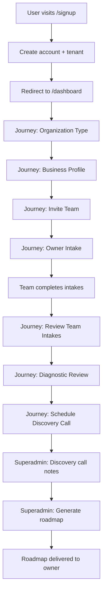
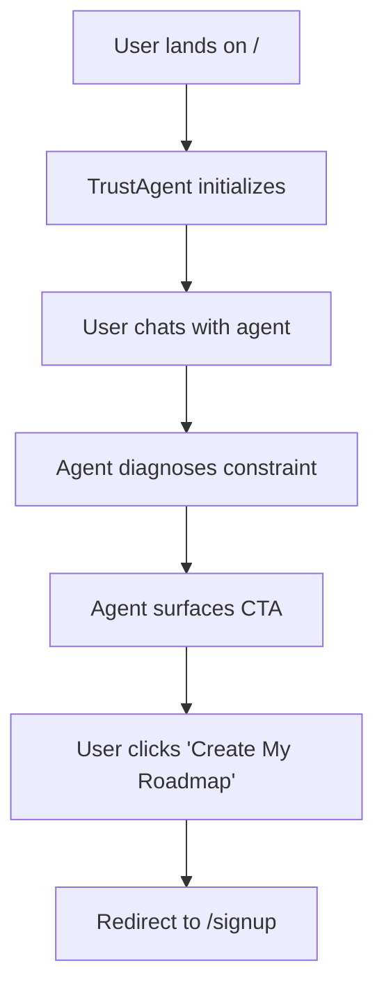
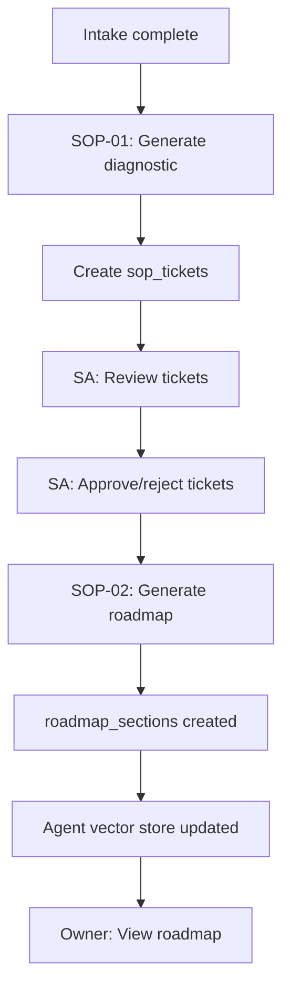

# Strategic AI Roadmaps - Complete System Reference

**Version:** 1.0  
**Last Updated:** 2025-12-18  
**Branch:** `feature/ghl-oauth-integration`  

---

## Table of Contents
1. [1. Architecture Overview](#1-architecture-overview)
2. [2. Technology Stack](#2-technology-stack)
3. [3. Database Schema](#3-database-schema)
4. [4. Backend Services](#4-backend-services)
5. [5. Frontend Architecture](#5-frontend-architecture)
6. [6. API Surface](#6-api-surface)
7. [7. TrustAgent System](#7-trustagent-system)
8. [8. External Integrations](#8-external-integrations)
9. [9. Critical Flows](#9-critical-flows)

---

## 1. Architecture Overview

**Type:** Monorepo (pnpm workspaces)  
**Workspaces:**
- `frontend/` - React SPA (Vite + TypeScript)
- `backend/` - Express API (TypeScript + Drizzle ORM)
- `shared/` - Shared types and utilities

**Deployment:**
- Frontend: Vercel (static SPA)
- Backend: Vercel Serverless Functions
- Database: Neon (PostgreSQL)
- File Storage: AWS S3

---

## 2. Technology Stack

### Backend Dependencies
```json
Core:
- express ^4.18.2
- drizzle-orm ^0.29.1
- pg ^8.16.3
- typescript ^5.3.3

AI/ML:
- openai ^4.104.0

Authentication:
- jsonwebtoken ^9.0.2
- bcryptjs ^2.4.3

Email:
- resend ^3.0.0

Storage:
- @aws-sdk/client-s3 ^3.675.0
- multer ^2.0.2

Utilities:
- dotenv ^16.3.1
- cors ^2.8.5
- express-rate-limit ^8.2.1
- nanoid ^5.0.4
- zod ^3.22.4
```

### Frontend Dependencies
```json
Core:
- react ^18.2.0
- wouter ^3.0.0 (routing)
- @tanstack/react-query ^5.17.9

UI Libraries:
- @tailwindcss/typography ^0.5.19
- lucide-react ^0.555.0
- @dnd-kit/core ^6.3.1
- recharts ^3.5.0

Content Rendering:
- react-markdown ^10.1.0
- react-syntax-highlighter ^16.1.0
- remark-gfm ^4.0.1

Utilities:
- jwt-decode ^4.0.0
- zod ^3.22.4
```

---

## 3. Database Schema

**ORM:** Drizzle  
**Total Tables:** 22  
**Schema File:** `backend/src/db/schema.ts` (754 lines)

### Core Tables

#### **tenants** (Multi-tenant root)
```typescript
{
  id: uuid,
  ownerUserId: uuid (unique),
  name: string,
  cohortLabel: string,
  segment: string,
  region: string,
  status: 'prospect' | 'active' | 'paused' | 'churned',
  businessType: 'default' | 'chamber',
  teamHeadcount: number,
  baselineMonthlyLeads: number,
  firmSizeTier: 'micro' | 'small' | 'mid' | 'large',
  discoveryComplete: boolean,
  lastDiagnosticId: string,
  notes: text
}
```

#### **users** (Authentication & roles)
```typescript
{
  id: uuid,
  email: string (unique),
  passwordHash: string,
  role: 'owner' | 'ops' | 'sales' | 'delivery' | 'teamlead' | 'superadmin',
  name: string,
  tenantId: uuid,
  resetToken: string,
  resetTokenExpiry: timestamp
}
```

#### **roadmaps** (Core deliverable)
```typescript
{
  id: uuid,
  tenantId: uuid,
  createdByUserId: uuid,
  pdfUrl: string,
  status: 'draft' | 'in_progress' | 'delivered',
  pilotStage: 'pilot_proposed' | 'pilot_active' | 'pilot_completed',
  deliveredAt: timestamp
}
```

#### **roadmap_sections** (Structured roadmap content)
```typescript
{
  id: uuid,
  roadmapId: uuid,
  sectionNumber: number, // 1-8
  sectionName: string,
  contentMarkdown: text,
  status: 'planned' | 'in_progress' | 'completed',
  agentCheatsheet: json, // AI-readable facts
  wordCount: number,
  diagrams: string[]
}
```

#### **agent_configs** (Multi-field prompt composition)
```typescript
{
  id: uuid,
  tenantId: uuid,
  agentType: 'roadmap_coach' | 'exec_overview',
  systemIdentity: text,
  businessContext: text, // auto-generated
  customInstructions: text, // owner-editable
  rolePlaybook: text, // Tony's IP
  toolContext: json,
  roadmapMetadata: json,
  openaiAssistantId: string,
  openaiVectorStoreId: string,
  openaiModel: string,
  isActive: boolean,
  configVersion: number
}
```

#### **agent_threads** (Conversation management)
```typescript
{
  id: uuid,
  tenantId: uuid,
  agentConfigId: uuid,
  roleType: string,
  openaiThreadId: string,
  actorUserId: uuid,
  actorRole: 'owner' | 'team' | 'superadmin',
  visibility: 'owner' | 'superadmin_only' | 'shared'
}
```

#### **sop_tickets** (Diagnostic-generated tickets)
```typescript
{
  id: uuid,
  tenantId: uuid,
  diagnosticId: string,
  ticketId: string, // e.g. "S3-T1"
  title: text,
  category: string,
  valueCategory: string,
  tier: string,
  painSource: text,
  approved: boolean,
  moderationStatus: 'pending' | 'approved' | 'rejected',
  description: text,
  currentState: text,
  targetState: text,
  aiDesign: text,
  ghlImplementation: text,
  implementationSteps: string[],
  owner: string,
  dependencies: string[],
  timeEstimateHours: number,
  costEstimate: number,
  successMetric: text,
  roadmapSection: string,
  priority: string,
  sprint: number,
  projectedHoursSavedWeekly: number,
  projectedLeadsRecoveredMonthly: number
}
```

### Supporting Tables

- **intakes** - Team member intake questionnaires
- **invites** - Team invitation system
- **onboarding_states** - Gamified onboarding progress
- **lead_requests** - Landing page cohort applications
- **tenant_documents** - SOP outputs, roadmaps, reports
- **ticket_packs** - Firm-specific ticket organization
- **ticket_instances** - Per-firm ticket state tracking
- **implementation_snapshots** - Metrics capture (baseline/30d/60d/90d)
- **roadmap_outcomes** - Realized results and ROI
- **discovery_call_notes** - SOP-02 prerequisite
- **public_agent_sessions** - Anonymous homepage agent
- **public_agent_events** - Analytics for homepage agent
- **tenant_metrics_daily** - SA dashboard rollups
- **audit_events** - System + SA actions
- **feature_flags** & **tenant_feature_flags** - Feature gating
- **impersonation_sessions** - SA impersonation tracking
- **agent_messages**, **agent_logs**, **agent_routing_rules** - Agent infrastructure

---

## 4. Backend Services

**Location:** `backend/src/services/`  
**Total Services:** 40

### Core Services

#### Agent & AI Services
- `agent.service.ts` (23.4 KB) - Primary agent orchestration
- `agentConfig.service.ts` - Agent configuration CRUD
- `agentPromptBuilder.service.ts` - Dynamic prompt composition
- `agentRouter.service.ts` - Pattern-based agent routing
- `assistantProvisioning.service.ts` - OpenAI Assistant creation
- `assistantQuery.service.ts` - OpenAI query execution
- `publicAgentSession.service.ts` - Homepage agent sessions
- `strategyContextBuilder.service.ts` - Runtime strategy context
- `tenantVectorStore.service.ts` - Per-tenant vector stores

#### Roadmap Services
- `roadmapAssembly.service.ts` - Full roadmap generation
- `roadmapPersistence.ts` - Database persistence
- `roadmapRefresh.service.ts` - Regeneration logic
- `roadmapSection.service.ts` - Section CRUD
- `roadmapAgentSync.service.ts` - Agent knowledge sync
- `roadmapMetadataExtractor.service.ts` - Extract agent cheatsheets
- `roadmapOs.service.ts` - Roadmap OS abstraction
- `finalRoadmap.service.ts` - Final deliverable generation
- `sectionStatusSync.service.ts` - Status propagation

#### Intake & Onboarding Services
- `intakeNormalizer.ts` - Normalize intake responses
- `onboardingProgress.service.ts` - Gamification tracking
- `discoveryCallService.ts` - Discovery note management

#### SOP & Ticket Services
- `sop01Engine.ts` - SOP-01 diagnostic engine
- `sop01Persistence.ts` - Ticket persistence
- `sopPackRenderer.service.ts` - SOP pack generation
- `sopTicketGenerator.service.ts` - Ticket creation
- `ticketPack.service.ts` - Ticket pack CRUD
- `ticketPackGenerator.service.ts` - Pack generation
- `ticketModeration.service.ts` - SA moderation workflow

#### Metrics & Outcomes
- `implementationMetrics.service.ts` - Snapshot management
- `metricNormalizer.service.ts` - Metric normalization
- `outcomeAggregate.service.ts` - ROI aggregation

#### Utilities
- `email.service.ts` - Resend email sending
- `storage.ts` - S3 file uploads
- `caseStudyExport.service.ts` - Export case studies
- `verified-compute.service.ts` - Tool verification
- `diagnosticIngestion.service.ts` - SOP-01 payload ingestion

---

## 4.1 Backend Controllers

**Location:** `backend/src/controllers/`  
**Total Controllers:** 26

### Primary Controllers

- `auth.controller.ts` (8.4 KB) - Login, signup, password reset
- `roadmap.controller.ts` (22.6 KB) - Roadmap CRUD & generation
- `superadmin.controller.ts` (79.9 KB) - Full SA dashboard
- `ownerDashboard.controller.ts` (14.4 KB) - Owner dashboard
- `intake.controller.ts` - Team intake submission
- `invite.controller.ts` - Team invitations
- `agent.controller.ts` - Agent chat interface
- `agentThread.controller.ts` - Thread management
- `assistantAgent.controller.ts` - Assistant provisioning
- `documents.controller.ts` (11.2 KB) - Document upload/download
- `tenants.controller.ts` - Tenant management
- `onboarding.controller.ts` - Onboarding progress
- `leadRequest.controller.ts` - Landing page lead capture
- `diagnostic.controller.ts` - Diagnostic payload handling
- `ticketModeration.controller.ts` - SA ticket approval
- `ticket.controller.ts` - Ticket CRUD
- `ticketInstance.controller.ts` - Ticket state updates
- `roadmapQnA.controller.ts` - Roadmap Q&A agent
- `finalRoadmap.controller.ts` - Final deliverable fetch
- `trustagentHomepage.controller.ts` (6.6 KB) - Homepage TrustAgent
- `pulseagentHomepage.controller.ts` - Legacy homepage agent
- `superadminAssistant.controller.ts` - SA agent
- `superadminRoadmapCoach.controller.ts` - SA roadmap agent
- `debugLogs.controller.ts` - Debug log viewer

---

## 6. API Surface

**Location:** `backend/src/routes/`  
**Total Route Files:** 21

### Route Definitions

```
/api/auth/*          - auth.routes.ts
/api/roadmap/*       - roadmap.routes.ts
/api/superadmin/*    - superadmin.routes.ts
/api/dashboard/*     - dashboard.routes.ts
/api/intake/*        - intake.routes.ts
/api/invite/*        - invite.routes.ts
/api/agent/*         - agent.routes.ts
/api/assistant/*     - assistantAgent.routes.ts
/api/agentThread/*   - agentThread.routes.ts
/api/agentConfig/*   - agentConfig.routes.ts
/api/documents/*     - documents.routes.ts
/api/tenants/*       - tenants.routes.ts
/api/onboarding/*    - onboarding.routes.ts
/api/lead-request/*  - leadRequest.routes.ts
/api/diagnostic/*    - diagnostic.routes.ts
/api/ticket/*        - ticket.routes.ts
/api/tickets/*       - ticketInstance.routes.ts
/api/trustagent/*    - trustagent.routes.ts
/api/pulseagent/*    - pulseagent.routes.ts
/api/debug-logs/*    - debugLogs.routes.ts
/api/superadmin/assistant/* - superadminAssistant.routes.ts
```

### Key Endpoints

#### Authentication
- `POST /api/auth/signup` - Create account
- `POST /api/auth/login` - Login
- `POST /api/auth/request-reset` - Request password reset
- `POST /api/auth/reset-password/:token` - Reset password

#### Roadmaps
- `GET /api/roadmap/:tenantId` - Fetch roadmap
- `POST /api/roadmap/generate` - Generate new roadmap
- `POST /api/roadmap/refresh` - Regenerate roadmap
- `GET /api/roadmap/final/:tenantId` - Get final deliverable
- `GET /api/roadmap/sections/:tenantId` - Get all sections
- `PATCH /api/roadmap/section/:sectionId/status` - Update section status

#### Agents
- `POST /api/agent/chat` - Send message
- `GET /api/agent/thread/:tenantId/:roleType` - Get thread
- `POST /api/trustagent/session` - Create homepage session
- `POST /api/trustagent/message` - Send homepage message

#### Superadmin
- `GET /api/superadmin/firms` - List all tenants
- `GET /api/superadmin/leads` - List lead requests
- `POST /api/superadmin/impersonate/:tenantId` - Impersonate tenant
- `GET /api/superadmin/roadmaps` - List all roadmaps
- `POST /api/superadmin/tickets/:tenantId/:diagnosticId/moderate` - Moderate tickets

#### Intakes
- `POST /api/intake/save` - Save intake progress
- `POST /api/intake/complete` - Complete intake
- `GET /api/intake/:tenantId` - Get tenant intakes

#### Documents
- `POST /api/documents/upload` - Upload document
- `GET /api/documents/:tenantId` - List tenant documents
- `DELETE /api/documents/:documentId` - Delete document

---

## 5. Frontend Architecture

**Location:** `frontend/src/`  

### Directory Structure

```
src/
├── components/          (48 files) - Reusable UI components
├── pages/               (30 files) - Route pages
├── context/             (4 files) - React contexts
├── trustagent/          (12 files) - TrustAgent UI
├── superadmin/          (20 files) - SA dashboard
├── lib/                 (4 files) - Utilities
├── types/               (5 files) - TypeScript types
├── api/                 (1 file) - API client
├── layouts/             (1 file) - Layout wrappers
├── intake/              (1 file) - Intake flows
└── utils/               (3 files) - Helpers
```

### Key Pages

#### Public Pages
- `TonyCameroLanding.tsx` - Personal portfolio homepage
- `LandingPage.tsx` - Strategic AI Roadmaps SaaS homepage
- `Auth.tsx` - Login page
- `Signup.tsx` - Signup flow
- `OnePager.tsx` - Diagnostic onepager (AG-TICKET-07-13)

#### Owner Portal
- `Dashboard.tsx` - Owner dashboard
- `BusinessProfile.tsx` - Business profile form
- `OrganizationType.tsx` - Organization type selection
- `InviteTeam.tsx` - Team invitation
- `OwnerIntake.tsx`, `OpsIntake.tsx`, `SalesIntake.tsx`, `DeliveryIntake.tsx` - Role-specific intakes
- `TeamIntakesReview.tsx` - Review team responses
- `DiagnosticReview.tsx` - Review diagnostic
- `DiscoveryCallScheduler.tsx` - Schedule discovery call
- `RoadmapViewer.tsx` - View final roadmap
- `AgentInbox.tsx` - Agent chat interface

#### Superadmin
- `SuperAdminLayout.tsx` - SA shell with navigation
- Firm management, lead pipeline, roadmap viewer, agent inbox

### React Contexts

- **AuthContext** - User authentication state
- **TenantContext** - Multi-tenant state
- **OnboardingContext** - Onboarding progress
- **RoadmapContext** - Roadmap navigation (new)

### Components (Key)

- `ProtectedRoute.tsx` - Route authentication wrapper
- `PhaseTimeline.tsx` - Visual onboarding timeline
- `OnboardingSidebar.tsx` - Journey sidebar
- `TicketModeration.tsx` - SA ticket approval UI
- `VideoModal.tsx`, `VideoThumbnail.tsx` - Promo video UI
- `mobile/NavDrawer.tsx`, `mobile/HamburgerButton.tsx` - Mobile navigation

---

## 7. TrustAgent System

### Backend Components

**Location:** `backend/src/trustagent/`  
**Total Files:** 30

#### Prompts
- `homepagePrompt.ts` - Main prompt
- `homepagePromptCore.ts` - Core logic
- `homepagePromptSystem.ts` - System instructions
- `homepagePromptCTA.ts` - CTA handling
- `homepagePromptHandoff.ts` - Handoff logic
- `homepagePromptLoop.ts` - Conversation loop
- `homepagePromptMemory.ts` - Memory management
- `homepagePromptTone.ts` - Tone guidance
- `homepagePromptAdaptiveDepth.ts` - Depth adaptation
- `homepagePromptFailsafe.ts` - Error handling

#### Services
- `services/sessionManagement.ts` - Session lifecycle
- `services/messageRouting.ts` - Message routing
- `services/analyticsTracking.ts` - Event tracking
- `services/voiceCapture.ts` - Voice note collection (AG-TICKET-07)

#### Inventory
- `inventory/diagnosticInventory.ts` - Diagnostic questions
- `inventory/evidenceInventory.ts` - Evidence categories
- `inventory/constraintInventory.ts` - Constraint classes

### Frontend Components

**Location:** `frontend/src/trustagent/`  
**Total Files:** 12

- `TrustAgentShell.tsx` - Main widget wrapper
- `TrustAgentUI.tsx` - Chat interface
- `TrustAgentBubble.tsx` - Floating button
- `analytics.ts` - Client-side tracking
- `visitorContext.ts` - Visitor metadata
- `sessionManager.ts` - Session state
- `useAgent.ts` - React hook

---

## 8. External Integrations

### OpenAI API
- **Model:** `gpt-4-1106-preview` (default)
- **Usage:**
  - Assistant API (persistent threads)
  - Vector stores (per-tenant knowledge)
  - File uploads (roadmap sections)
- **Keys:** `OPENAI_API_KEY`

### Resend (Email)
- **Purpose:** Transactional emails
- **Templates:** Password reset, team invitations
- **Key:** `RESEND_API_KEY`

### AWS S3
- **Purpose:** Document storage
- **Buckets:** TBD (configured via env)
- **Keys:** `AWS_ACCESS_KEY_ID`, `AWS_SECRET_ACCESS_KEY`, `AWS_REGION`

### Neon (PostgreSQL)
- **Purpose:** Primary database
- **Connection:** `DATABASE_URL`

### Vercel
- **Purpose:** Hosting (frontend + backend)
- **Build:** `vercel-build` script
- **Env:** Configured via Vercel dashboard

---

## 9. Critical Flows

### 1. Signup → Roadmap Delivery



### 2. Homepage TrustAgent → Signup



### 3. Diagnostic → Ticket Moderation → Roadmap



---

## Environment Variables

### Backend
```bash
# Core
NODE_ENV=development
PORT=3001
DATABASE_URL=postgresql://...

# JWT
JWT_SECRET=...
JWT_EXPIRES_IN=7d

# OpenAI
OPENAI_API_KEY=sk-...

# Email
RESEND_API_KEY=re_...
FROM_EMAIL=noreply@tonycamero.com

# AWS S3
AWS_ACCESS_KEY_ID=...
AWS_SECRET_ACCESS_KEY=...
AWS_REGION=us-west-2
S3_BUCKET=...

# URLs
FRONTEND_URL=https://www.tonycamero.com
BACKEND_URL=https://api.tonycamero.com
```

### Frontend
```bash
VITE_API_URL=http://localhost:3001/api
```

---

## Deployment

### Build Process
```bash
# Full monorepo build
pnpm build

# Individual workspaces
pnpm --filter frontend build
pnpm --filter backend build
pnpm --filter shared build
```

### Vercel Configuration
**File:** `vercel.json`
```json
{
  "buildCommand": "cd shared && pnpm build && cd ../frontend && pnpm build",
  "outputDirectory": "frontend/dist",
  "framework": "vite"
}
```

### Database Migrations
```bash
# Generate migration
pnpm db:generate

# Apply migration (dev)
pnpm db:push

# Apply migration (prod)
pnpm db:migrate
```

---

## Scripts

### Backend Scripts
```bash
# Development
pnpm --filter backend dev

# OpenAI provisioning
pnpm --filter backend provision:assistants
pnpm --filter backend provision:homepage-trustagent

# Metrics
pnpm --filter backend metrics:capture
pnpm --filter backend metrics:outcome
pnpm --filter backend metrics:aggregate

# SOPs
pnpm --filter backend sop01:run
pnpm --filter backend discovery:save
pnpm --filter backend roadmap:refresh

# Testing
pnpm --filter backend test:diagnostic
```

### Database Scripts
```bash
pnpm db:generate  # Generate migrations
pnpm db:push      # Push schema (dev)
pnpm db:migrate   # Run migrations (prod)
pnpm db:studio    # Open Drizzle Studio
```

---

## Key Design Patterns

### Multi-Tenancy
- Every major table has `tenantId: uuid`
- Middleware enforces row-level security
- Superadmin can impersonate tenants

### Agent Architecture
- **Per-tenant assistants** with dedicated vector stores
- **Agent configs** store prompt composition
- **Agent threads** track conversations
- **Strategy contexts** provide runtime state

### Onboarding Gamification
- **onboarding_states** track progress
- Points, steps, badges stored as JSONB
- Sidebar visualizes journey

### SOP-Driven Development
- SOP-01: Diagnostic generation
- SOP-02: Roadmap assembly
- SOPs are code, not documents

---

## Known Gaps (Future Work)

1. **GHL OAuth Integration** - Analyzed but not implemented (see `GHL_ROADMAP_REFACTOR_ANALYSIS.md`)
2. **Mobile app** - Currently web-only
3. **Stripe integration** - Payment flow incomplete
4. **Email templates** - Basic Resend templates, need branding
5. **Testing** - Limited test coverage
6. **Monitoring** - No error tracking (Sentry/LogRocket)
7. **CI/CD** - Manual deployments

---

## Documentation Index

**Root Docs:**
- `README.md` - Quick start
- `QUICKSTART.md` - Setup guide
- `PRODUCT_SPEC.md` - Product vision
- `EXECUTION_PLAN.md` - Implementation roadmap

**Architecture Docs:**
- `AGENT_ARCHITECTURE.md` - Agent system design
- `AI_ORG_CHART_ARCHITECTURE.md` - Multi-agent architecture
- `WHITEPAPER_AI_ORG_CHART.md` - Theoretical foundation

**Implementation Guides:**
- `IMPLEMENTATION_GUIDE.md` - Full implementation guide
- `ONBOARDING_IMPLEMENTATION.md` - Onboarding flow
- `FRONTEND_BUILD_GUIDE.md` - Frontend setup
- `INTEGRATION_GUIDE.md` - External integrations
- `MULTI_TENANT_MIGRATION_GUIDE.md` - Multi-tenancy setup

**SOPs:**
- `SOPs/` directory (36 files)

**Status Reports:**
- `PROJECT_STATUS.md` - Current state
- `IMPLEMENTATION_STATUS.md` - Progress tracker

---

**END OF SYSTEM REFERENCE**
