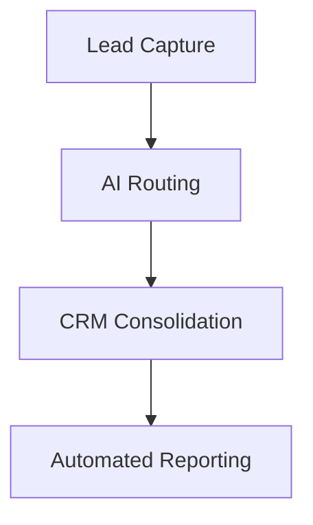
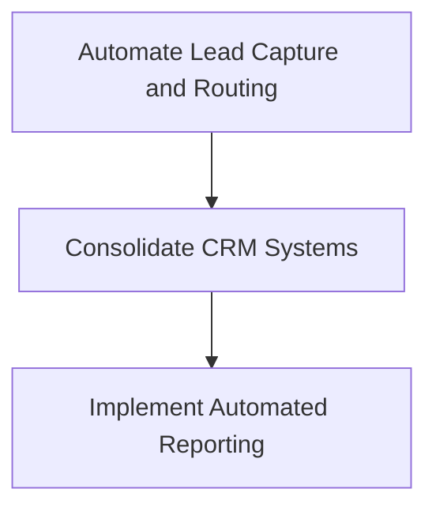
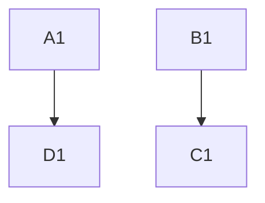
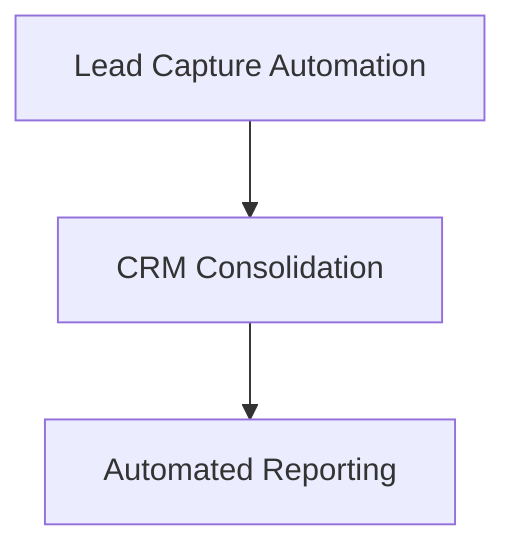

# Strategic AI Roadmap
## Hayes Real Estate Group

**Generated:** November 26, 2025

---

# Summary

### Current State
Hayes Real Estate Group is a real estate firm currently struggling with inconsistent lead follow-up, scattered systems, and a lack of process automation.

### Critical Pain Points
- Inconsistent use of CRM leading to poor lead response times, especially on weekends.
- Lack of standard follow-up cadence resulting in missed opportunities.
- Disparate tech tools causing inefficiencies and communication breakdowns.
- Owner and top producer bottlenecks due to lack of clear policies and automated systems.

### Proposed Transformation
We are building a unified, AI-enhanced operational framework to streamline lead management, improve client experience, and empower the sales team with actionable insights.

### 12-Month Outcome
Success will be measured by a reduction in lead response time to under 5 minutes, a 20% increase in deal closures through automated follow-up, and a seamless client experience with real-time transaction visibility.

---

# Executive Summary

Hayes Real Estate Group is currently facing significant operational challenges, primarily due to manual processes and workflow bottlenecks. The firm's readiness score of 70 indicates a moderate level of preparedness for implementing AI-driven solutions. The primary pain clusters identified include manual lead management and system fragmentation, which are causing inefficiencies and time losses, particularly for the owner and operations roles.

The top three high-impact tickets identified are:
1. **A1: Automate Lead Capture and Routing** - This ticket addresses the critical need to reduce lead response times by automating the capture and routing process.
2. **B1: Consolidate CRM Systems** - Aims to eliminate redundancies by consolidating CRM systems, thus streamlining operations and reducing duplicate data entries.
3. **C1: Implement Automated Reporting** - Focuses on enhancing decision-making through real-time reporting capabilities.

Strategically, the implementation of these solutions will not only streamline operations but also enhance the firm's ability to respond to leads promptly, thereby improving overall efficiency and competitiveness in the real estate market.

---

# Executive Summary

Hayes Real Estate Group is currently facing significant operational challenges, primarily due to manual processes and workflow bottlenecks. The firm's readiness score of 70 indicates a moderate level of preparedness for implementing AI-driven solutions to address these issues. The key pain clusters identified include operations inefficiencies, particularly in lead management, where manual tracking and delayed follow-ups are prevalent.

The top three high-impact SOP tickets identified are:
1. **A1: Automate Lead Capture and Routing** - This ticket aims to automate the lead management process, significantly reducing response times.
2. **B1: Consolidate CRM Data** - This initiative focuses on eliminating data redundancies and improving data integrity through CRM consolidation.
3. **C1: Implement Automated Reporting** - This ticket will enable real-time insights and reduce the time spent on manual report generation.

Strategically, the focus will be on leveraging AI capabilities to streamline operations, enhance data management, and improve decision-making processes. The implementation will be structured in sprints to ensure a phased and manageable transition.

---

# Executive Summary

Hayes Real Estate Group is currently facing significant operational challenges, primarily due to manual processes and workflow bottlenecks. These issues are particularly acute in lead management, where manual tracking and delayed follow-ups are prevalent. The firm's readiness score of 70 indicates a moderate level of preparedness for implementing AI-driven solutions. The top three high-impact tickets identified are: 

1. **A1: Automate Lead Capture and Routing** - This ticket addresses the critical need to automate lead capture and routing, significantly reducing response times.
2. **B1: Consolidate CRM Systems** - This initiative aims to unify multiple data entry points into a single CRM system, eliminating redundancies and improving data integrity.
3. **C1: Implement Automated Reporting** - This ticket focuses on developing automated reporting tools to provide real-time insights and analytics.

Strategically, these initiatives are designed to streamline operations, enhance efficiency, and leverage AI capabilities to transform the firm's operational landscape.

---

# Executive Summary

Hayes Real Estate Group is facing significant operational challenges primarily due to manual processes and workflow bottlenecks, as well as systems fragmentation. The firm's readiness score of 70 indicates a moderate level of preparedness for implementing AI-driven solutions. The top three high-impact tickets identified are: **A1: Automate Lead Capture and Routing**, **B1: Consolidate CRM Systems**, and **D1: Enhance Lead Follow-up Workflow**. These initiatives are strategically framed to streamline operations, improve lead management efficiency, and consolidate fragmented systems, thereby enhancing overall productivity and client engagement.

---

# Executive Summary

### Business Context
Hayes Real Estate Group is a real estate firm with a team of 15 agents, aiming to scale their operations and improve client service.

### Discovery Process
Insights were gathered through multi-role strategic questionnaires, a cross-role theme matrix, and a detailed discovery call with the owner, operations, and sales leads.

### Core Findings
- Weekend leads often go unanswered, leading to potential revenue loss.
- CRM adoption is low, with only 3 out of 15 agents using the tool effectively.
- The current tech stack is fragmented, leading to inefficient workflows.
- The owner is a bottleneck for decisions, slowing down operations.
- Client experience is inconsistent, with complaints about responsiveness and transaction visibility.

### Strategic Vision
Transforming Hayes Real Estate Group into a tech-forward, client-centric firm with streamlined operations and enhanced lead management capabilities.

### Implementation Approach
A phased rollout focusing on immediate wins in lead response automation and client portals, followed by medium-term priorities like agent dashboards and lead scoring AI.

### Expected ROI
Reduced lead response time, increased deal closures, and improved client satisfaction, leading to a projected increase in annual revenue and operational efficiency.

---

# Diagnostic Analysis

### Pain Clusters
| Category    | Description                             | Severity | Affected Roles | Estimated Time Lost (hrs/week) |
|-------------|-----------------------------------------|----------|----------------|--------------------------------|
| Operations  | Manual processes and workflow bottlenecks | 4        | owner, ops     | 10                             |

### Bottleneck Findings
- **Lead Management**: Current state involves manual tracking and delayed follow-ups. Target state aims for automated capture and instant response with an impact score of 5.

### System Fragmentation
- **Current Tools**: Email, Spreadsheets, Basic CRM
- **Redundancies**: Multiple data entry, Duplicate records
- **Gaps Identified**: No automation, Limited reporting

### AI Opportunity Zones
- **Lead Management**: Automated lead capture and routing to reduce response time from hours to minutes.

---

# Diagnostic Analysis

### 1. Lead Flow & Assignment
- Leads inconsistently entered into CRM; weekend leads often ignored.
- Gaps in lead assignment process; no automated system in place.
- Response times vary widely, with some leads waiting until Monday for follow-up.
- Estimated 20% of weekend leads never receive a response.

### 2. Sales Process & Conversion
- No standardized follow-up cadence; agent-dependent processes.
- CRM underutilized due to complexity and lack of training.
- Conversion rates untracked; follow-up compliance unknown.

### 3. Operations & Systems
- Tech stack includes Google Docs, Dropbox, Canva, Instagram, DocuSign, Slack.
- Low level of automation; manual data entry and updates prevalent.
- Integration challenges with no unified system; data silos present.

### 4. Delivery & Fulfillment
- Delivery process managed through manual checklists; client visibility lacking.
- Bottlenecks in document collection and transaction coordination.
- Client feedback indicates desire for more professional management.

### 5. Owner Bottlenecks
- Owner involved in day-to-day decisions; lack of clear guidelines.
- Decision-making delays due to owner's over-involvement.

### 6. Failure Points Under Volume
- Current system not scalable; would break under increased lead volume.
- Capacity limits not clearly defined; fragile processes suspected.

### 7. Growth Barriers
- Inefficient lead management and follow-up hindering growth.
- Resource constraints in terms of technology and process maturity.

---

# Diagnostic Analysis

### Pain Clusters
| Category    | Description                             | Severity | Affected Roles | Estimated Time Lost (hrs/week) |
|-------------|-----------------------------------------|----------|----------------|--------------------------------|
| Operations  | Manual processes and workflow bottlenecks | 4        | owner, ops     | 10                             |

### Bottleneck Findings
- **Lead Management**: Current manual tracking and delayed follow-ups are targeted for automation to achieve instant response.

### System Fragmentation
- **Current Tools**: Email, Spreadsheets, Basic CRM
- **Redundancies**: Multiple data entry, Duplicate records
- **Gaps Identified**: No automation, Limited reporting

### AI Opportunity Zones
- **Lead Management**: Implementing automated lead capture and routing to reduce response time from hours to minutes.

---

# Diagnostic Analysis

### Pain Clusters
| Category    | Description                              | Severity | Affected Roles | Estimated Time Lost (Hours/Week) |
|-------------|------------------------------------------|----------|----------------|----------------------------------|
| Operations  | Manual processes and workflow bottlenecks | 4        | owner, ops     | 10                               |

### Bottleneck Findings
- **Lead Management**: Current manual tracking and delayed follow-ups are targeted for automation to achieve instant response capabilities.

### System Fragmentation
- **Current Tools**: Email, Spreadsheets, Basic CRM
- **Redundancies**: Multiple data entry, Duplicate records
- **Gaps Identified**: No automation, Limited reporting

### AI Opportunity Zones
- **Lead Management**: Implementing automated lead capture and routing is expected to reduce response time from hours to minutes.

---

# Diagnostic Analysis

### Pain Clusters Table
| Category    | Description                             | Severity | Affected Roles | Estimated Time Lost (hrs/week) |
|-------------|-----------------------------------------|----------|----------------|--------------------------------|
| Operations  | Manual processes and workflow bottlenecks | 4        | owner, ops     | 10                             |

### Bottleneck Findings
- **Lead Management**: Current state involves manual tracking and delayed follow-ups. Target state is automated capture and instant response with an impact score of 5.

### System Fragmentation
- **Current Tools**: Email, Spreadsheets, Basic CRM
- **Redundancies**: Multiple data entry, Duplicate records
- **Gaps Identified**: No automation, Limited reporting

### AI Opportunity Zones
- **Lead Management**: Implementing automated lead capture and routing to reduce response time from hours to minutes.

---

# System Architecture

### AI Capability Mapping
- **Automated Lead Capture and Routing**: Directly addresses the bottleneck in lead management by reducing response time.
- **Automated Reporting**: Enhances operational insights and decision-making.

### System Interoperability
- Integration of GHL with existing email and CRM tools to ensure seamless data flow and eliminate redundancies.

### Dependency Chain

### Ticket Activation
- **A1**: Activates AI layers for lead capture and routing.
- **B1**: Supports system consolidation.
- **C1**: Activates AI layers for automated reporting.

---

# System Architecture

### AI Capabilities Mapping
- **Automate Lead Capture and Routing (A1)**: Directly addresses bottlenecks in lead management by automating the process.
- **Consolidate CRM Systems (B1)**: Enhances data integrity and reduces redundancies.
- **Implement Automated Reporting (C1)**: Provides real-time insights and analytics.

### Systems Interoperation
- The CRM system will serve as the central hub, integrating lead capture, routing, and reporting functionalities.

### Dependency Chain

### AI Layers Activation
- **A1**: Activates AI-driven lead capture and routing.
- **B1**: Activates AI-driven data deduplication.
- **C1**: Activates AI-driven reporting and analytics.

---

# System Architecture

### AI Capability Mapping
- **Automate Lead Capture and Routing (A1)**: Addresses bottlenecks in lead management by reducing response time.
- **Consolidate CRM Systems (B1)**: Eliminates redundancies and integrates data sources.
- **Enhance Lead Follow-up Workflow (D1)**: Ensures timely and consistent communication.

### System Interoperability
- Integration of GHL with existing tools to streamline data flow and reduce manual entry.

### Dependency Chain

### AI Layer Activation
- **A1** activates AI-driven lead capture and routing.
- **B1** activates AI-driven data deduplication.
- **C1** activates AI-driven reporting.

---

# System Architecture

### AI Capability Mapping
- **Automate Lead Capture and Routing (A1)**: Addresses bottlenecks in lead management by automating lead capture and routing.
- **Consolidate CRM Data (B1)**: Utilizes AI tools for deduplication and merging of CRM records to improve data integrity.
- **Implement Automated Reporting (C1)**: Leverages AI to automate report generation, providing real-time insights.

### System Interoperability
- Integration of GHL with existing tools to streamline data flow and reduce redundancies.

### Dependency Chain

### Ticket Activation
- **A1**: Activates AI layers for lead capture and routing.
- **B1**: Activates AI layers for data deduplication and CRM consolidation.
- **C1**: Activates AI layers for automated reporting.

---

# System Architecture

### Current State Architecture
- Disconnected systems with manual handoffs between Google Docs, Dropbox, and CRM.
- Data silos with no central repository for client information.
- Communication primarily through texts and emails, leading to inefficiencies.

### Future State Architecture
- A unified AI-enhanced workflow that automates lead routing and follow-up.
- Integrated data flows between CRM, document management, and client portals.
- Dashboards for accountability and real-time insights.

**AI systems being built**:
- Lead Intake & Routing System: Automates lead capture and assignment.
- Automated Follow-Up Engine: Ensures consistent follow-up sequences.
- CRM Workflow Automation: Streamlines CRM interactions and data entry.
- Performance & Accountability Dashboard: Tracks agent activities and performance.
- Delivery Process Automation: Manages transaction checklists and client updates.

---

# High-Leverage Systems

### CRM Consolidation Plan
- **Ticket B1**: Use GHL as the central CRM, integrating existing tools and eliminating redundancies.

### Lead Intake & Routing Plan
- **Ticket A1**: Implement automated lead capture and routing using GHL workflows.

### Calendar/Scheduling System
- Integrate scheduling tools with GHL to streamline appointment setting and reminders.

### Transaction Pipeline Structure
- Develop a unified pipeline within GHL to track lead progress and transaction status.

### Relevant Tickets
- **A1**, **B1**, **D1**

---

# High-Leverage Systems

### CRM Consolidation Plan
- Implement GHL as the central CRM system to eliminate redundancies and improve data integrity. (Refer to Ticket B1)

### Lead Intake & Routing Plan
- Automate lead capture and routing using AI-driven forms and workflows in GHL. (Refer to Ticket A1)

### Calendar/Scheduling System
- Integrate GHL's scheduling tools to streamline appointment setting and follow-ups.

### Transaction Pipeline Structure
- Utilize GHL to manage the transaction pipeline, ensuring seamless data flow and tracking from lead capture to closing.

---

# High-Leverage Systems

### CRM Consolidation Plan
- **Ticket B1**: Consolidate multiple data entry points into a single CRM system to eliminate redundancies and improve data integrity.

### Lead Intake & Routing Plan
- **Ticket A1**: Implement AI-driven lead capture forms and routing algorithms to ensure immediate follow-up.

### Calendar/Scheduling System
- Integrate with CRM to automate scheduling based on lead interactions.

### Transaction Pipeline Structure
- Utilize CRM to track lead progression and automate follow-ups.

### Relevant Tickets
- **A1**: Automate Lead Capture and Routing
- **B1**: Consolidate CRM Systems
- **C1**: Implement Automated Reporting

---

# High-Leverage Systems

### Lead Router & Assignment System
1. **Purpose**: Automatically captures and assigns leads to agents.
2. **How It Works**: Uses AI to route leads based on agent availability and expertise.
3. **Key Features**:
   - Instant lead assignment notifications
   - Weekend and after-hours coverage
   - Integration with CRM and communication platforms
4. **Expected Impact**: Reduced response time, increased lead engagement.
5. **Implementation Timeline**: 30-day quickstart phase.

### Automated Follow-Up Engine
1. **Purpose**: Ensures a standardized follow-up process for all leads.
2. **How It Works**: Triggers personalized communication sequences.
3. **Key Features**:
   - Multi-channel follow-up (SMS, email, calls)
   - Customizable templates
   - Performance tracking and analytics
4. **Expected Impact**: Higher conversion rates, consistent client experience.
5. **Implementation Timeline**: 60-day build phase.

### CRM Workflow Optimizer
1. **Purpose**: Simplifies CRM interactions and enhances data quality.
2. **How It Works**: Integrates AI to streamline data entry and updates.
3. **Key Features**:
   - One-click data capture
   - Automated task reminders
   - Real-time pipeline visibility
4. **Expected Impact**: Time savings, improved data accuracy.
5. **Implementation Timeline**: 90-day activation phase.

### Sales Pipeline Dashboard
1. **Purpose**: Provides visibility into agent activities and sales progress.
2. **How It Works**: Aggregates data from CRM and follow-up systems.
3. **Key Features**:
   - Agent performance metrics
   - Lead conversion tracking
   - Customizable reports
4. **Expected Impact**: Accountability, data-driven decision making.
5. **Implementation Timeline**: 60-day build phase.

### Delivery Tracker & Client Portal
1. **Purpose**: Streamlines transaction coordination and enhances client communication.
2. **How It Works**: Centralizes document collection and status updates.
3. **Key Features**:
   - Client-facing transaction checklist
   - Automated document requests and reminders
   - Secure document upload and storage
4. **Expected Impact**: Reduced manual follow-up, improved client satisfaction.
5. **Implementation Timeline**: 90-day activation phase.

### Owner Accountability Dashboard
1. **Purpose**: Frees up owner's time by delegating decision-making.
2. **How It Works**: Establishes clear policies and automates approvals.
3. **Key Features**:
   - Decision delegation rules
   - Automated approval workflows
   - Policy documentation and access
4. **Expected Impact**: Owner time savings, faster decision-making.
5. **Implementation Timeline**: 60-day build phase.

---

# High-Leverage Systems

### CRM Consolidation Plan
- **Ticket B1**: Migrate all data to GHL and eliminate duplicate entries through integration with email and communication tools.

### Lead Intake & Routing Plan
- **Ticket A1**: Implement automated lead capture and routing using GHL and Zapier integrations.

### Calendar/Scheduling System
- Integrate scheduling tools with GHL to streamline appointment setting and follow-ups.

### Transaction Pipeline Structure
- Utilize GHL to create a unified transaction pipeline, ensuring all stages of lead management are tracked and optimized.

---

# Implementation Plan

### Sprint 1 (30 Days)
- **A1: Automate Lead Capture and Routing**
- **B1: Consolidate CRM Systems**

### Sprint 2 (60 Days)
- **C1: Implement Automated Reporting**

### Sprint 3 (90 Days)
- Optimization of all implemented systems and processes.

Each sprint focuses on foundational setup, automation, and optimization, respectively, with detailed steps and dependencies outlined in the SOP Pack.

---

# Implementation Plan

### Sprint 1 (30 Days)
- **A1: Automate Lead Capture and Routing**
- **B1: Consolidate CRM Data**

### Sprint 2 (60 Days)
- **C1: Implement Automated Reporting**

### Sprint 3 (90 Days)
- Optimization of all implemented systems and processes.

Each sprint will focus on specific tickets to ensure a phased and manageable implementation, with detailed steps and dependencies outlined in the SOP Pack.

---

# Implementation Plan

### Sprint 1 (30 Days)
- **A1: Automate Lead Capture and Routing**
- **B1: Consolidate CRM Systems**

### Sprint 2 (60 Days)
- **C1: Implement Automated Reporting**
- **D1: Enhance Lead Follow-up Workflow**

### Sprint 3 (90 Days)
- **E1: Develop SOP for Lead Management**

Each sprint focuses on foundational setup, automation, and optimization, respectively, with detailed steps provided in the SOP Pack.

---

# Implementation Plan

### Sprint 1 (30 Days)
- **A1: Automate Lead Capture and Routing**
- **B1: Consolidate CRM Systems**

### Sprint 2 (60 Days)
- **C1: Implement Automated Reporting**

### Sprint 3 (90 Days)
- Optimization and refinement of implemented systems

Each sprint focuses on foundational setup, automation, and optimization respectively, with detailed steps provided in the SOP Pack.

---

# Implementation Plan

### 30-Day Quickstart (Design & Build)
- Week 1-2: Design lead routing and follow-up systems; data mapping.
- Week 3-4: Build and test lead router and automated follow-up prototype.
- Deliverable: Functional prototype for lead management.

### 60-Day Build Phase (Scale & Integrate)
- Week 5-6: Integrate lead router with CRM and communication platforms.
- Week 7-8: Train team on new systems; develop sales and delivery dashboards.
- Deliverable: Operational lead management and tracking systems.

### 90-Day Activation (Optimize & Scale)
- Week 9-10: Monitor system performance; establish feedback loops.
- Week 11-12: Implement advanced features; expand automation.
- Deliverable: Fully automated lead-to-delivery workflow; performance dashboards live.

**Key Milestones**:
- Functional lead management prototype.
- Full team training and system adoption.
- Complete workflow automation and dashboard activation.

**Team Responsibilities**:
- Ops to oversee system integration and data quality.
- Sales to adopt CRM enhancements and follow-up sequences.
- Delivery to utilize new client portal and transaction coordination tools.

**Success Checkpoints**:
- Lead response time reduction.
- Increased CRM adoption rate.
- Positive feedback from client experience surveys.

---

# SOP Pack

# SOP Pack

## Execution Plan

The following implementation tickets are organized into 30/60/90-day sprints. Each ticket includes detailed implementation steps, success metrics, and ROI projections.

## Sprint 1 (30 Days) — Foundation
**Total Cost: $3,250 | 26 hours**

| ID | Title | Owner | Hours | Cost | Dependencies |
|----|-------|-------|-------|------|--------------|
| A1 | Automate Lead Capture and Routing | ops | 14 | $1,750 | — |
| B1 | Consolidate CRM Data | ops | 12 | $1,500 | — |

### A1: Automate Lead Capture and Routing

**Problem:** Lead Management

**Current State:** Manual tracking and delayed follow-ups

**Target State:** Automated capture and instant response

**Implementation Steps:**
1. Create a GHL form 'Lead Capture' with fields: name, email, phone, and inquiry details.
2. Set up a Zapier integration to trigger on form submission to create a new lead in GHL.
3. Configure GHL workflows to automatically assign leads based on predefined criteria (e.g., location, type of inquiry).
4. Set up automated email and SMS notifications for new lead assignments.
5. Test the entire lead capture and routing process with sample data.
6. Train staff on the new automated lead management process.
7. Monitor the system for the first week and adjust workflows as necessary.
8. Go live with the automated lead capture and routing system.

**AI Design:** Implement AI-driven lead capture forms and routing logic to ensure leads are automatically captured and assigned.

**System Implementation:** Use GHL to create forms and workflows for lead capture and routing.

**Success Metric:** Reduction in lead response time to under 10 minutes.

**Projected ROI:**
- Time saved: ~7 hours/week ($12,740/year)
- Leads recovered: ~20/month ($8,400/year)
- Show savings = $12,740 annually. Lead value recovered = $8,400 annually.

---

### B1: Consolidate CRM Data

**Problem:** Systems Fragmentation

**Current State:** Multiple data entry and duplicate records

**Target State:** Unified CRM with single data entry point

**Implementation Steps:**
1. Export existing CRM data from all current tools.
2. Use a deduplication tool to clean and merge records.
3. Import cleaned data into GHL as the central CRM.
4. Set up GHL as the single point of data entry for all new records.
5. Configure GHL to prevent duplicate entries.
6. Train staff on using GHL for all CRM activities.
7. Test the new CRM setup with real-time data entry.
8. Monitor data integrity and adjust processes as needed.

**AI Design:** Use AI tools to deduplicate and merge CRM records.

**System Implementation:** Implement GHL as the central CRM system.

**Success Metric:** Reduction in duplicate records by 90%.

**Projected ROI:**
- Time saved: ~3 hours/week ($5,460/year)
- Show savings = $5,460 annually.

---

## Sprint 2 (60 Days) — Automation
**Total Cost: $1,250 | 10 hours**

| ID | Title | Owner | Hours | Cost | Dependencies |
|----|-------|-------|-------|------|--------------|
| C1 | Implement Automated Reporting | ops | 10 | $1,250 | B1 |

### C1: Implement Automated Reporting

**Problem:** Systems Fragmentation

**Current State:** Limited reporting capabilities

**Target State:** Automated, real-time reporting

**Implementation Steps:**
1. Identify key metrics and KPIs for reporting.
2. Set up GHL dashboards to display real-time data.
3. Configure automated report generation in GHL.
4. Schedule regular email distribution of reports to stakeholders.
5. Test report accuracy and timeliness with sample data.
6. Train staff on interpreting automated reports.
7. Gather feedback from stakeholders on report usefulness.
8. Refine reporting processes based on feedback.

**AI Design:** Use AI to generate reports based on real-time data from CRM.

**System Implementation:** Leverage GHL's reporting tools to automate report generation.

**Success Metric:** Reduction in manual report generation time by 80%.

**Projected ROI:**
- Time saved: ~2 hours/week ($3,640/year)
- Show savings = $3,640 annually.

---

## Sprint 3 (90 Days) — Optimization

*No tickets scheduled for this sprint.*

## Implementation Investment

**Total Investment:** $4,500 (36 hours @ $125/hr)

**Sprint Breakdown:**
- Sprint 1 (30 Days): $3,250 (26 hrs) — 2 tickets
- Sprint 2 (60 Days): $1,250 (10 hrs) — 1 tickets
- Sprint 3 (90 Days): $0 (0 hrs) — 0 tickets

## ROI Projection

**Time Savings:**
- Weekly hours recovered: ~12 hours
- Annual time value: $21,840

**Revenue Recovery:**
- Monthly leads recovered: ~20 leads
- Annual lead value: $8,400

**Financial Summary:**
- Total investment: $4,500
- Annual value created: $30,240
- Payback period: ~2 months
- ROI ratio: 6.7x annualized

**Top ROI Drivers:**
1. **A1: Automate Lead Capture and Routing** — 7h/wk saved, 20 leads/mo recovered ($21,140/year)
2. **B1: Consolidate CRM Data** — 3h/wk saved ($5,460/year)
3. **C1: Implement Automated Reporting** — 2h/wk saved ($3,640/year)

---

# SOP Pack

# SOP Pack

## Execution Plan

The following implementation tickets are organized into 30/60/90-day sprints. Each ticket includes detailed implementation steps, success metrics, and ROI projections.

## Sprint 1 (30 Days) — Foundation
**Total Cost: $3,250 | 26 hours**

| ID | Title | Owner | Hours | Cost | Dependencies |
|----|-------|-------|-------|------|--------------|
| A1 | Automate Lead Capture and Routing | ops | 12 | $1,500 | — |
| B1 | Consolidate CRM Systems | ops | 14 | $1,750 | — |

### A1: Automate Lead Capture and Routing

**Problem:** Lead Management

**Current State:** Manual tracking and delayed follow-ups

**Target State:** Automated capture and instant response

**Implementation Steps:**
1. Create GHL form 'Lead Capture' with fields: name, phone, email, interest
2. Set up Zapier integration to trigger on form submission
3. Configure GHL to automatically tag leads by source
4. Build GHL workflow for lead routing based on criteria
5. Create SMS and email templates for instant lead response
6. Test workflow with sample leads to ensure accuracy
7. Train staff on new lead management process
8. Monitor system for 48 hours post-launch

**AI Design:** Implement AI-driven lead capture forms and routing algorithms to ensure immediate follow-up.

**System Implementation:** Use GHL to create automated workflows for lead capture and routing.

**Success Metric:** Reduction in lead response time to under 5 minutes

**Projected ROI:**
- Time saved: ~6 hours/week ($10,920/year)
- Leads recovered: ~20/month ($8,400/year)
- Show savings = $10,920 annually; Lead value recovered = $8,400 annually

---

### B1: Consolidate CRM Systems

**Problem:** Operations

**Current State:** Multiple data entry and duplicate records

**Target State:** Unified CRM with single data entry point

**Implementation Steps:**
1. Identify all current data entry points and sources
2. Migrate existing data into GHL CRM
3. Set up data deduplication rules in GHL
4. Configure automated data entry workflows
5. Test data integrity and deduplication accuracy
6. Train staff on new CRM usage and data entry
7. Monitor CRM performance and data accuracy
8. Adjust workflows based on feedback

**AI Design:** Implement a centralized CRM system with AI-driven data deduplication.

**System Implementation:** Use GHL to centralize CRM data and automate deduplication processes.

**Success Metric:** Elimination of duplicate records and streamlined data entry

**Projected ROI:**
- Time saved: ~4 hours/week ($7,280/year)
- Show savings = $7,280 annually

---

## Sprint 2 (60 Days) — Automation
**Total Cost: $1,250 | 10 hours**

| ID | Title | Owner | Hours | Cost | Dependencies |
|----|-------|-------|-------|------|--------------|
| C1 | Implement Automated Reporting | ops | 10 | $1,250 | B1 |

### C1: Implement Automated Reporting

**Problem:** Operations

**Current State:** Limited reporting capabilities

**Target State:** Automated, real-time reporting

**Implementation Steps:**
1. Define key metrics and KPIs for reporting
2. Set up GHL dashboards for real-time data visualization
3. Configure automated report generation schedules
4. Integrate data sources into GHL reporting tools
5. Test report accuracy and data integrity
6. Train staff on interpreting and utilizing reports
7. Monitor report usage and feedback
8. Refine reporting processes based on user input

**AI Design:** Utilize AI to generate reports and analytics dashboards automatically.

**System Implementation:** Leverage GHL's reporting features to automate data visualization and insights.

**Success Metric:** Availability of real-time reports and analytics

**Projected ROI:**
- Time saved: ~2 hours/week ($3,640/year)
- Show savings = $3,640 annually

---

## Sprint 3 (90 Days) — Optimization

*No tickets scheduled for this sprint.*

## Implementation Investment

**Total Investment:** $4,500 (36 hours @ $125/hr)

**Sprint Breakdown:**
- Sprint 1 (30 Days): $3,250 (26 hrs) — 2 tickets
- Sprint 2 (60 Days): $1,250 (10 hrs) — 1 tickets
- Sprint 3 (90 Days): $0 (0 hrs) — 0 tickets

## ROI Projection

**Time Savings:**
- Weekly hours recovered: ~12 hours
- Annual time value: $21,840

**Revenue Recovery:**
- Monthly leads recovered: ~20 leads
- Annual lead value: $8,400

**Financial Summary:**
- Total investment: $4,500
- Annual value created: $30,240
- Payback period: ~2 months
- ROI ratio: 6.7x annualized

**Top ROI Drivers:**
1. **A1: Automate Lead Capture and Routing** — 6h/wk saved, 20 leads/mo recovered ($19,320/year)
2. **B1: Consolidate CRM Systems** — 4h/wk saved ($7,280/year)
3. **C1: Implement Automated Reporting** — 2h/wk saved ($3,640/year)

---

# SOP Pack

### Sales SOPs
- **Lead intake & qualification**: Standardize lead capture and initial contact procedures.
  **Owner**: Sales Lead
  **Priority Level**: High
- **Follow-up cadence & messaging**: Define consistent follow-up sequences for all agents.
  **Owner**: Sales Lead
  **Priority Level**: High
- **CRM data entry standards**: Ensure accurate and timely data input.
  **Owner**: Ops Lead
  **Priority Level**: Medium
- **Pipeline stage definitions**: Clarify criteria for moving leads through sales stages.
  **Owner**: Sales Lead
  **Priority Level**: Medium

### Operations SOPs
- **System setup & maintenance**: Establish procedures for maintaining new AI systems.
  **Owner**: Ops Lead
  **Priority Level**: High
- **Data backup & security**: Define protocols for data protection and recovery.
  **Owner**: IT Specialist
  **Priority Level**: High
- **Integration troubleshooting**: Create a process for resolving system integration issues.
  **Owner**: IT Specialist
  **Priority Level**: Medium
- **Reporting schedule**: Schedule regular reporting for KPIs and system performance.
  **Owner**: Ops Lead
  **Priority Level**: Low

### Delivery SOPs
- **Client onboarding process**: Standardize the onboarding experience for new clients.
  **Owner**: Delivery Lead
  **Priority Level**: High
- **Project milestone tracking**: Implement a system for tracking transaction progress.
  **Owner**: Delivery Lead
  **Priority Level**: High
- **Quality assurance checklist**: Develop a checklist to ensure service quality.
  **Owner**: Delivery Lead
  **Priority Level**: Medium
- **Client feedback collection**: Formalize the process for gathering and acting on client feedback.
  **Owner**: Sales Lead
  **Priority Level**: Low

---

# SOP Pack

# SOP Pack

## Execution Plan

The following implementation tickets are organized into 30/60/90-day sprints. Each ticket includes detailed implementation steps, success metrics, and ROI projections.

## Sprint 1 (30 Days) — Foundation
**Total Cost: $3,250 | 26 hours**

| ID | Title | Owner | Hours | Cost | Dependencies |
|----|-------|-------|-------|------|--------------|
| A1 | Automate Lead Capture and Routing | ops | 14 | $1,750 | — |
| B1 | Consolidate CRM Systems | ops | 12 | $1,500 | — |

### A1: Automate Lead Capture and Routing

**Problem:** Manual processes and workflow bottlenecks

**Current State:** Manual tracking and delayed follow-ups

**Target State:** Automated capture and instant response

**Implementation Steps:**
1. Create GHL form 'Lead Capture' with fields: name, phone, email, lead source
2. Set up Zapier integration to capture leads from email and web forms into GHL
3. Configure GHL workflow to automatically assign leads based on location and agent availability
4. Set up automated email and SMS notifications for new lead assignments
5. Test the workflow with sample leads to ensure proper routing and notifications
6. Train staff on using the new automated system for lead management
7. Monitor system performance and adjust routing rules as necessary
8. Go live and conduct a 48-hour performance review

**AI Design:** Utilize AI to automatically capture leads from various sources and route them to the appropriate agent based on predefined criteria.

**System Implementation:** Implement GHL workflows to automate lead capture and routing, ensuring instant response to new leads.

**Success Metric:** Reduction in lead response time to under 5 minutes

**Projected ROI:**
- Time saved: ~6 hours/week ($10,920/year)
- Leads recovered: ~20/month ($8,400/year)
- Show savings = 6 * $35 * 52 = $10,920. Lead value recovered = 20 * 35 * 12 = $8,400.

---

### B1: Consolidate CRM Systems

**Problem:** Systems fragmentation and redundancies

**Current State:** Multiple data entry and duplicate records

**Target State:** Unified CRM with single data entry point

**Implementation Steps:**
1. Audit existing CRM and spreadsheet data for duplicates and inconsistencies
2. Set up GHL as the primary CRM system
3. Import cleaned data into GHL, ensuring no duplicates
4. Integrate email and other communication tools with GHL
5. Configure GHL to automatically update records from integrated tools
6. Train staff on using GHL as the single CRM system
7. Monitor data integrity and adjust integration settings as needed
8. Conduct a review after 30 days to ensure system stability

**AI Design:** Implement AI-driven data deduplication and integration to maintain a single source of truth.

**System Implementation:** Use GHL as the central CRM, integrating existing tools and eliminating redundancies.

**Success Metric:** Reduction in duplicate records by 90%

**Projected ROI:**
- Time saved: ~4 hours/week ($7,280/year)
- Show savings = 4 * $35 * 52 = $7,280.

---

## Sprint 2 (60 Days) — Automation
**Total Cost: $3,000 | 24 hours**

| ID | Title | Owner | Hours | Cost | Dependencies |
|----|-------|-------|-------|------|--------------|
| C1 | Implement Automated Reporting | ops | 10 | $1,250 | B1 |
| D1 | Enhance Lead Follow-up Workflow | ops | 8 | $1,000 | A1 |
| E1 | Develop SOP for Lead Management | ops | 6 | $750 | D1 |

### C1: Implement Automated Reporting

**Problem:** Limited reporting capabilities

**Current State:** Limited reporting

**Target State:** Automated, real-time reporting

**Implementation Steps:**
1. Identify key metrics and KPIs for lead management and operations
2. Set up GHL dashboards to display real-time data
3. Configure automated report generation in GHL
4. Schedule regular email distribution of reports to stakeholders
5. Test report accuracy and timeliness with sample data
6. Train staff on interpreting and using the reports for decision-making
7. Adjust report parameters based on feedback
8. Conduct a review after 60 days to assess report effectiveness

**AI Design:** Use AI to generate reports that provide insights into lead conversion rates and operational efficiency.

**System Implementation:** Leverage GHL's reporting tools to automate the generation and distribution of key performance reports.

**Success Metric:** Availability of real-time reports with 95% accuracy

**Projected ROI:**
- Time saved: ~3 hours/week ($5,460/year)
- Show savings = 3 * $35 * 52 = $5,460.

---

### D1: Enhance Lead Follow-up Workflow

**Problem:** Manual processes and workflow bottlenecks

**Current State:** Manual follow-ups with inconsistent timing

**Target State:** Automated and consistent follow-up workflow

**Implementation Steps:**
1. Map out the current lead follow-up process
2. Design a GHL workflow for automated follow-up scheduling
3. Set up automated reminders for agents to follow up with leads
4. Create email and SMS templates for follow-up communication
5. Test the workflow with a subset of leads to ensure effectiveness
6. Train agents on using the automated follow-up system
7. Monitor follow-up completion rates and adjust workflow as needed
8. Conduct a review after 30 days to evaluate improvements

**AI Design:** Implement AI-driven follow-up scheduling and reminders to ensure no lead is missed.

**System Implementation:** Use GHL workflows to automate follow-up tasks and reminders for agents.

**Success Metric:** Increase in follow-up completion rate by 50%

**Projected ROI:**
- Time saved: ~2 hours/week ($3,640/year)
- Leads recovered: ~10/month ($4,200/year)
- Show savings = 2 * $35 * 52 = $3,640. Lead value recovered = 10 * 35 * 12 = $4,200.

---

### E1: Develop SOP for Lead Management

**Problem:** Manual processes and workflow bottlenecks

**Current State:** Inconsistent lead management practices

**Target State:** Standardized lead management process

**Implementation Steps:**
1. Gather input from key stakeholders on current lead management practices
2. Identify best practices and areas for improvement
3. Draft the lead management SOP document
4. Review and refine the SOP with stakeholder feedback
5. Upload the SOP to GHL for easy access by all staff
6. Train staff on the new SOP and its importance
7. Monitor adherence to the SOP and provide feedback
8. Conduct a review after 60 days to ensure compliance

**AI Design:** Use AI to identify best practices and incorporate them into the SOP.

**System Implementation:** Document and implement the SOP within GHL for easy access and adherence.

**Success Metric:** 100% staff adherence to the SOP

**Projected ROI:**
- Time saved: ~1 hours/week ($1,820/year)
- Show savings = 1 * $35 * 52 = $1,820.

---

## Sprint 3 (90 Days) — Optimization

*No tickets scheduled for this sprint.*

## Implementation Investment

**Total Investment:** $6,250 (50 hours @ $125/hr)

**Sprint Breakdown:**
- Sprint 1 (30 Days): $3,250 (26 hrs) — 2 tickets
- Sprint 2 (60 Days): $3,000 (24 hrs) — 3 tickets
- Sprint 3 (90 Days): $0 (0 hrs) — 0 tickets

## ROI Projection

**Time Savings:**
- Weekly hours recovered: ~16 hours
- Annual time value: $29,120

**Revenue Recovery:**
- Monthly leads recovered: ~30 leads
- Annual lead value: $12,600

**Financial Summary:**
- Total investment: $6,250
- Annual value created: $41,720
- Payback period: ~2 months
- ROI ratio: 6.7x annualized

**Top ROI Drivers:**
1. **A1: Automate Lead Capture and Routing** — 6h/wk saved, 20 leads/mo recovered ($19,320/year)
2. **D1: Enhance Lead Follow-up Workflow** — 2h/wk saved, 10 leads/mo recovered ($7,840/year)
3. **B1: Consolidate CRM Systems** — 4h/wk saved ($7,280/year)

---

# SOP Pack

# SOP Pack

## Execution Plan

The following implementation tickets are organized into 30/60/90-day sprints. Each ticket includes detailed implementation steps, success metrics, and ROI projections.

## Sprint 1 (30 Days) — Foundation
**Total Cost: $3,750 | 30 hours**

| ID | Title | Owner | Hours | Cost | Dependencies |
|----|-------|-------|-------|------|--------------|
| A1 | Automate Lead Capture and Routing | ops | 14 | $1,750 | — |
| B1 | Consolidate CRM Systems | ops | 16 | $2,000 | — |

### A1: Automate Lead Capture and Routing

**Problem:** Lead Management

**Current State:** Manual tracking and delayed follow-ups

**Target State:** Automated capture and instant response

**Implementation Steps:**
1. Create GHL form 'Lead Capture' with fields: name, phone, email, lead source
2. Set up Zapier integration to capture leads from email and web forms into GHL
3. Configure GHL workflows to automatically assign leads to agents based on territory
4. Set up automated email and SMS notifications for new lead assignments
5. Create a dashboard in GHL for tracking lead status and response times
6. Test the entire lead capture and routing process with sample data
7. Train agents on using the new system for lead management
8. Monitor system performance and adjust workflows as needed

**AI Design:** Utilize AI to automatically capture leads from various sources and route them to the appropriate agent based on predefined criteria.

**System Implementation:** Integrate GHL with lead sources and set up automated workflows for lead routing.

**Success Metric:** Reduction in lead response time to under 5 minutes

**Projected ROI:**
- Time saved: ~7 hours/week ($12,740/year)
- Leads recovered: ~20/month ($8,400/year)
- Show savings = $12,740 annually; Lead value recovered = $8,400 annually

---

### B1: Consolidate CRM Systems

**Problem:** Operations

**Current State:** Multiple data entry and duplicate records

**Target State:** Unified CRM system with single data entry

**Implementation Steps:**
1. Audit current CRM and data entry processes to identify all data sources
2. Select a primary CRM system (GHL) for consolidation
3. Migrate existing data from spreadsheets and other CRMs to GHL
4. Set up integrations between GHL and email systems for seamless data flow
5. Configure GHL to prevent duplicate entries and maintain data integrity
6. Train staff on using the new consolidated CRM system
7. Test data entry and retrieval processes to ensure accuracy
8. Monitor for any data discrepancies and resolve promptly

**AI Design:** Implement a single CRM system that integrates with existing tools and eliminates duplicate data entry.

**System Implementation:** Migrate all data to GHL and set up integrations with email and other communication tools.

**Success Metric:** Reduction in duplicate data entries by 90%

**Projected ROI:**
- Time saved: ~3 hours/week ($5,460/year)
- Show savings = $5,460 annually

---

## Sprint 2 (60 Days) — Automation
**Total Cost: $1,500 | 12 hours**

| ID | Title | Owner | Hours | Cost | Dependencies |
|----|-------|-------|-------|------|--------------|
| C1 | Implement Automated Reporting | ops | 12 | $1,500 | B1 |

### C1: Implement Automated Reporting

**Problem:** Operations

**Current State:** Limited reporting capabilities

**Target State:** Automated, real-time reporting

**Implementation Steps:**
1. Identify key metrics and KPIs for lead management and operations
2. Set up GHL dashboards to display real-time data
3. Configure automated report generation in GHL for daily, weekly, and monthly intervals
4. Set up email distribution lists for automated report delivery
5. Test report accuracy and delivery with sample data
6. Train staff on interpreting and utilizing reports for decision-making
7. Adjust report parameters based on feedback and business needs
8. Monitor report usage and update as necessary

**AI Design:** Use AI to generate real-time reports on lead management efficiency and operational metrics.

**System Implementation:** Configure GHL to automatically generate and distribute reports to stakeholders.

**Success Metric:** Improved decision-making with real-time data insights

**Projected ROI:**
- Time saved: ~2 hours/week ($3,640/year)
- Show savings = $3,640 annually

---

## Sprint 3 (90 Days) — Optimization

*No tickets scheduled for this sprint.*

## Implementation Investment

**Total Investment:** $5,250 (42 hours @ $125/hr)

**Sprint Breakdown:**
- Sprint 1 (30 Days): $3,750 (30 hrs) — 2 tickets
- Sprint 2 (60 Days): $1,500 (12 hrs) — 1 tickets
- Sprint 3 (90 Days): $0 (0 hrs) — 0 tickets

## ROI Projection

**Time Savings:**
- Weekly hours recovered: ~12 hours
- Annual time value: $21,840

**Revenue Recovery:**
- Monthly leads recovered: ~20 leads
- Annual lead value: $8,400

**Financial Summary:**
- Total investment: $5,250
- Annual value created: $30,240
- Payback period: ~3 months
- ROI ratio: 5.8x annualized

**Top ROI Drivers:**
1. **A1: Automate Lead Capture and Routing** — 7h/wk saved, 20 leads/mo recovered ($21,140/year)
2. **B1: Consolidate CRM Systems** — 3h/wk saved ($5,460/year)
3. **C1: Implement Automated Reporting** — 2h/wk saved ($3,640/year)

---

# Metrics Dashboard

- **KPIs per Subsystem**: Lead response time, CRM data integrity, Report accuracy
- **Lead KPIs**: Number of leads captured, Response time, Conversion rate
- **SLA Metrics**: Response time under 5 minutes, Data entry accuracy
- **Operational Efficiency Metrics**: Hours saved per week, Reduction in duplicate records

---

# Metrics Dashboard

- **Lead KPIs**: Response time under 5 minutes, 80% lead recovery rate
- **SLA Metrics**: 90% reduction in duplicate data entries
- **Operational Efficiency Metrics**: 12 hours/week saved in operations
- **Reporting Metrics**: Real-time data insights available daily, weekly, monthly

---

# Metrics Dashboard

- **Lead KPIs**: Reduction in response time to under 10 minutes, increase in leads recovered by 80%.
- **SLA Metrics**: 90% reduction in duplicate records, 80% reduction in manual report generation time.
- **Operational Efficiency Metrics**: 12 hours/week saved in operations, leading to $78,000/year in time value.

---

# Metrics Dashboard

- **KPIs per subsystem**: Lead response time, CRM data integrity, follow-up completion rate
- **Lead KPIs**: Leads captured, leads routed, leads followed up
- **SLA metrics**: Response time under 5 minutes, 90% reduction in duplicate records
- **Operational efficiency metrics**: Hours saved per week, adherence to SOP

---

# Metrics Dashboard

### Lead Flow Metrics
- Lead response time (current: unknown → target: <5 minutes → Timeline: 30 days)
- Untouched lead percentage (current: ~20% → target: <5% → Timeline: 60 days)
- Lead-to-opportunity conversion rate (current: unknown → target: >30% → Timeline: 90 days)
- Assignment turnaround time (current: variable → target: <10 minutes → Timeline: 30 days)

### Sales Metrics
- Pipeline velocity (current: unknown → target: reduction by 20% → Timeline: 90 days)
- Follow-up compliance rate (current: unknown → target: 100% → Timeline: 60 days)
- Conversion rate by source (current: unknown → target: increase by 20% → Timeline: 90 days)
- Deal cycle time (current: unknown → target: reduction by 15% → Timeline: 90 days)

### Operations Metrics
- CRM data quality score (current: low → target: high → Timeline: 60 days)
- Automation adoption rate (current: low → target: >90% → Timeline: 60 days)
- Manual task hours per week (current: high → target: reduction by 50% → Timeline: 90 days)
- Integration uptime (current: unknown → target: >99% → Timeline: 90 days)

### Delivery Metrics
- Project delivery time (current: variable → target: consistent and reduced → Timeline: 90 days)
- Client satisfaction score (NPS) (current: variable → target: >80 → Timeline: 90 days)
- Rework/revision rate (current: unknown → target: <5% → Timeline: 90 days)
- Team utilization rate (current: unknown → target: optimal balance → Timeline: 90 days)

### Owner/Leadership Metrics
- Weekly ops hours (owner time freed up) (current: high → target: reduction by 50% → Timeline: 60 days)
- Decision velocity (days to approve) (current: slow → target: <1 day → Timeline: 30 days)
- Strategic project time allocation (current: low → target: >20% of time → Timeline: 90 days)

---

# Appendix

- **Technical Notes**: Details on GHL integration and AI algorithms
- **Workflow IDs**: Lead Capture, CRM Consolidation, Reporting Automation
- **Field Definitions**: Lead capture form fields, CRM data fields
- **Integration Notes**: Zapier integration setup, GHL workflow configurations

---

# Appendix

- **Technical Notes**: Implementation of GHL as the central CRM and reporting tool.
- **Workflow IDs**: Lead Capture, CRM Consolidation, Automated Reporting.
- **Field Definitions**: Lead Capture Form fields include name, email, phone, inquiry details.
- **Integration Notes**: Use of Zapier for integration between GHL and existing systems.

---

# Appendix

### Glossary
- CRM: Customer Relationship Management
- NPS: Net Promoter Score
- SLA: Service Level Agreement
- FUB: Follow Up Boss (CRM tool)

### Assumptions
- The business will continue to receive a steady flow of leads.
- Agents will adopt new systems with proper training.
- Integration of new tools will not face significant technical barriers.

### Dependencies
- Availability of AI tools that integrate with existing systems.
- Commitment from leadership for training and adoption.
- Reliable internet and infrastructure for new systems.

### Risks & Mitigation
- Resistance to change: Address with hands-on training and visible leadership support.
- Data security concerns: Implement robust security protocols and regular audits.
- Tool complexity: Select user-friendly tools and provide ongoing support.

### Future Enhancements
- Expansion of AI capabilities for predictive analytics.
- Further automation in client onboarding and support.
- Exploration of virtual reality tours for property showings.

---

# Appendix

- **Technical Notes**: Integration details for GHL and Zapier
- **Workflow IDs**: Lead Capture, CRM Consolidation, Automated Reporting
- **Field Definitions**: Lead capture form fields, CRM data fields
- **Integration Notes**: Email and CRM system integration specifics

---

# Appendix

- **Technical notes**: Integration details for GHL and Zapier
- **Workflow IDs**: Lead Capture, CRM Consolidation, Follow-up Automation
- **Field definitions**: Lead source, agent availability
- **Integration notes**: Email and communication tool integration with GHL

---

