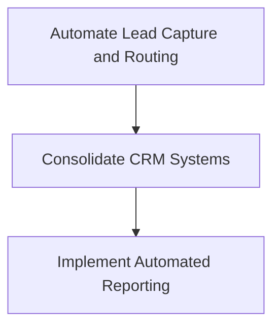

# Strategic AI Roadmap
## Hayes Real Estate Group

**Generated:** November 26, 2025

---

# Executive Summary

Hayes Real Estate Group is currently facing significant operational challenges, primarily due to manual processes and workflow bottlenecks. The firm's readiness score of 70 indicates a moderate level of preparedness for implementing AI-driven solutions. The primary pain clusters identified include operations inefficiencies and systems fragmentation, which result in substantial time losses and data redundancies.

The top three high-impact tickets identified are:
1. **A1: Automate Lead Capture and Routing** - This ticket addresses the critical need to reduce lead response times and improve efficiency by automating lead management processes.
2. **B1: Consolidate CRM Systems** - This initiative aims to eliminate data redundancies and improve data integrity by unifying CRM systems.
3. **C1: Implement Automated Reporting** - This ticket focuses on enhancing reporting capabilities to provide real-time insights and reduce manual efforts.

Strategically, the implementation of these solutions will streamline operations, enhance data management, and provide actionable insights, positioning Hayes Real Estate Group for growth and improved client engagement.

---

# Diagnostic Analysis

### Pain Clusters
| Category     | Description                              | Severity | Affected Roles       | Estimated Time Lost (Hours/Week) |
|--------------|------------------------------------------|----------|----------------------|----------------------------------|
| Operations   | Manual processes and workflow bottlenecks| 4        | owner, ops           | 10                               |

### Bottleneck Findings
- **Lead Management**: Current manual tracking and delayed follow-ups are targeted for automation to achieve instant response capabilities.

### System Fragmentation
- **Current Tools**: Email, Spreadsheets, Basic CRM
- **Redundancies**: Multiple data entry, Duplicate records
- **Gaps Identified**: No automation, Limited reporting

### AI Opportunity Zones
- **Lead Management**: Implementing automated lead capture and routing is expected to reduce response times from hours to minutes.

---

# System Architecture

### AI Capability Mapping
- **Automated Lead Capture and Routing**: Directly addresses bottlenecks in lead management by reducing response times.
- **Automated Reporting**: Enhances operational efficiency by providing real-time insights.

### System Interoperability
- Integration of CRM and lead management systems to ensure seamless data flow and eliminate redundancies.

### Dependency Chain

### Ticket Activation
- **A1** activates AI layers for lead management automation.
- **B1** supports system consolidation and data integrity.
- **C1** enhances reporting capabilities.

---

# High-Leverage Systems

### CRM Consolidation Plan
- **Ticket B1**: Migrate existing CRM data into GHL, set up deduplication processes, and configure user access.

### Lead Intake & Routing Plan
- **Ticket A1**: Implement automated lead capture and routing using GHL and Zapier integrations.

### Calendar/Scheduling System
- Integrate scheduling tools with CRM for seamless appointment management.

### Transaction Pipeline Structure
- Streamline transaction processes by integrating CRM and lead management systems to ensure data consistency and efficiency.

---

# Implementation Plan

### Sprint 1 (30 Days)
- **A1: Automate Lead Capture and Routing**
- **B1: Consolidate CRM Systems**

### Sprint 2 (60 Days)
- **C1: Implement Automated Reporting**

### Sprint 3 (90 Days)
- Optimization and refinement of implemented systems

Each sprint focuses on specific tickets to ensure a structured and phased approach to implementation, with detailed steps provided in the SOP Pack.

---

# SOP Pack

# SOP Pack

## Execution Plan

The following implementation tickets are organized into 30/60/90-day sprints. Each ticket includes detailed implementation steps, success metrics, and ROI projections.

## Sprint 1 (30 Days) — Foundation
**Total Cost: $3,250 | 26 hours**

| ID | Title | Owner | Hours | Cost | Dependencies |
|----|-------|-------|-------|------|--------------|
| A1 | Automate Lead Capture and Routing | ops | 14 | $1,750 | — |
| B1 | Consolidate CRM Systems | ops | 12 | $1,500 | — |

### A1: Automate Lead Capture and Routing

**Problem:** Manual processes and workflow bottlenecks

**Current State:** Manual tracking and delayed follow-ups

**Target State:** Automated capture and instant response

**Implementation Steps:**
1. Create GHL form 'Lead Capture' with fields: name, phone, email, lead source
2. Set up Zapier integration to capture leads from email and web forms into GHL
3. Configure GHL workflows to automatically assign leads to agents based on territory
4. Set up automated email and SMS notifications for new lead assignments
5. Test lead capture and routing with sample data from different sources
6. Train staff on new lead management process and fallback procedures
7. Monitor system performance and adjust workflows as needed
8. Go live with automated lead capture and routing system

**AI Design:** Utilize AI to automatically capture leads from various sources and route them to the appropriate agents based on predefined criteria.

**System Implementation:** Integrate GHL with lead sources and set up automated workflows for lead routing.

**Success Metric:** Reduction in lead response time to under 5 minutes

**Projected ROI:**
- Time saved: ~7 hours/week ($12,740/year)
- Leads recovered: ~20/month ($8,400/year)
- Show savings = 7 * $35 * 52 = $12,740; Lead value recovered = 20 * 35 * 12 = $8,400

---

### B1: Consolidate CRM Systems

**Problem:** Systems fragmentation and redundancies

**Current State:** Multiple data entry and duplicate records

**Target State:** Unified CRM with single data entry point

**Implementation Steps:**
1. Audit current CRM and spreadsheet data for duplicates and inconsistencies
2. Export data from existing CRM and spreadsheets
3. Import data into GHL, ensuring data integrity and consistency
4. Set up GHL deduplication workflows to prevent future duplicates
5. Configure user access and permissions in GHL
6. Train staff on using the new consolidated CRM system
7. Test CRM functionality with real-world scenarios
8. Monitor CRM performance and user feedback for improvements

**AI Design:** Implement AI-driven data deduplication and integration to streamline CRM operations.

**System Implementation:** Migrate existing CRM data into GHL and set up deduplication processes.

**Success Metric:** Reduction in duplicate records by 90%

**Projected ROI:**
- Time saved: ~3 hours/week ($5,460/year)
- Show savings = 3 * $35 * 52 = $5,460

---

## Sprint 2 (60 Days) — Automation
**Total Cost: $1,250 | 10 hours**

| ID | Title | Owner | Hours | Cost | Dependencies |
|----|-------|-------|-------|------|--------------|
| C1 | Implement Automated Reporting | ops | 10 | $1,250 | B1 |

### C1: Implement Automated Reporting

**Problem:** Limited reporting capabilities

**Current State:** Manual report generation with limited insights

**Target State:** Automated, real-time reporting with actionable insights

**Implementation Steps:**
1. Identify key metrics and KPIs for reporting
2. Design GHL dashboards to display real-time data
3. Set up automated report generation and distribution via email
4. Integrate GHL with data visualization tools for enhanced reporting
5. Test report accuracy and relevance with sample data
6. Train staff on interpreting and utilizing automated reports
7. Gather feedback and refine reporting processes
8. Launch automated reporting system and monitor for improvements

**AI Design:** Use AI to generate reports that provide insights into lead management and operational efficiency.

**System Implementation:** Set up GHL dashboards and automated report generation.

**Success Metric:** Reduction in manual reporting time by 80%

**Projected ROI:**
- Time saved: ~4 hours/week ($7,280/year)
- Show savings = 4 * $35 * 52 = $7,280

---

## Sprint 3 (90 Days) — Optimization

*No tickets scheduled for this sprint.*

## Implementation Investment

**Total Investment:** $4,500 (36 hours @ $125/hr)

**Sprint Breakdown:**
- Sprint 1 (30 Days): $3,250 (26 hrs) — 2 tickets
- Sprint 2 (60 Days): $1,250 (10 hrs) — 1 tickets
- Sprint 3 (90 Days): $0 (0 hrs) — 0 tickets

## ROI Projection

**Time Savings:**
- Weekly hours recovered: ~14 hours
- Annual time value: $25,480

**Revenue Recovery:**
- Monthly leads recovered: ~20 leads
- Annual lead value: $8,400

**Financial Summary:**
- Total investment: $4,500
- Annual value created: $33,880
- Payback period: ~2 months
- ROI ratio: 7.5x annualized

**Top ROI Drivers:**
1. **A1: Automate Lead Capture and Routing** — 7h/wk saved, 20 leads/mo recovered ($21,140/year)
2. **C1: Implement Automated Reporting** — 4h/wk saved ($7,280/year)
3. **B1: Consolidate CRM Systems** — 3h/wk saved ($5,460/year)

---

# Metrics Dashboard

- **KPIs per Subsystem**: Lead response time, CRM data integrity, Reporting accuracy
- **Lead KPIs**: Number of leads captured, Response time, Conversion rate
- **SLA Metrics**: Lead response time under 5 minutes, CRM data accuracy above 90%
- **Operational Efficiency Metrics**: Hours saved per week, Reduction in manual processes

---

# Appendix

- **Technical Notes**: Details on GHL integration and AI capabilities
- **Workflow IDs**: Lead capture, CRM consolidation, Reporting automation
- **Field Definitions**: Lead capture form fields, CRM data fields
- **Integration Notes**: Zapier setup, GHL workflows, Data visualization tools

---

