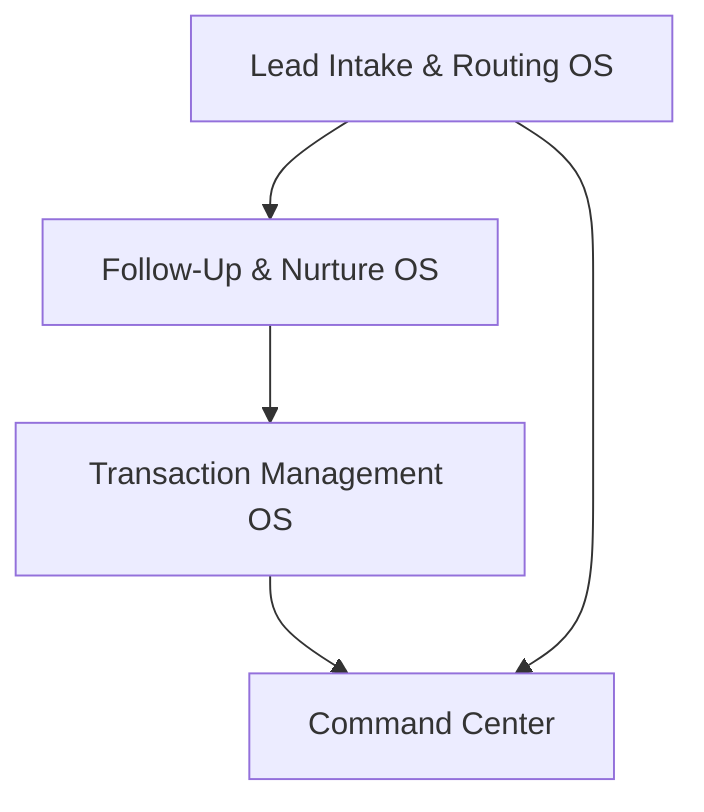

# Strategic AI Roadmap
## Hayes Real Estate Group

**Generated:** November 26, 2025

---

# Executive Summary

### Current State
- **Lead Management Inefficiencies**: The current manual lead management process results in delayed follow-ups, particularly over weekends, leading to an estimated 20% of leads being unaddressed.
- **Systems Fragmentation**: The firm uses a variety of disconnected tools, leading to data redundancies and inefficiencies, with agents often bypassing the CRM due to its complexity.
- **Operational Bottlenecks**: Manual processes and lack of automation result in significant time lost, with an estimated 10 hours per week wasted on operations.

### Proposed Transformation
We propose building an integrated system that automates lead capture and routing, consolidates CRM systems, and implements automated reporting. This transformation will streamline operations, enhance lead management, and improve client interactions, ultimately supporting sustainable growth.

### Financial Summary
- **Total Investment**: $5,500 (44 hours @ $125/hr)
- **Weekly Time Savings**: 15 hours/week
- **Annual Time Value**: $27,300/year
- **Leads Recovered**: 30/month
- **Annual Lead Value**: $12,600/year
- **Payback Period**: 7 weeks
- **ROI**: 725%

### 30/60/90 Snapshot
- **Sprint 1 (30 days)**: Implement automated lead capture and routing ($1,750)
- **Sprint 2 (60 days)**: Consolidate CRM systems and optimize lead follow-up workflow ($2,500)
- **Sprint 3 (90 days)**: Implement automated reporting and refine follow-up processes ($1,250)

### Top 3 High-Impact Tickets
- **A1**: Automate Lead Capture and Routing - Reduces lead response time to under 5 minutes.
- **B1**: Consolidate CRM Systems - Eliminates duplicate records, streamlining data management.
- **D1**: Optimize Lead Follow-up Workflow - Increases follow-up completion rate by 70%.

---

# Diagnostic Analysis

### Current State
Hayes Real Estate Group is currently facing significant operational inefficiencies, primarily due to manual processes and fragmented systems. The firm struggles with delayed lead follow-ups, particularly over weekends, leading to a substantial number of leads being unaddressed. The use of multiple disconnected tools results in data redundancies and inefficiencies, with agents often bypassing the CRM due to its complexity.

### Critical Pain Points
- **Operations**: Manual processes and workflow bottlenecks are a major issue, affecting both the owner and operations team, leading to an estimated 10 hours of lost time weekly.
- **Lead Management**: The current manual tracking and delayed follow-ups in lead management result in significant inefficiencies, impacting the firm's ability to respond promptly to leads.
- **Systems Fragmentation**: The use of multiple tools like Email, Spreadsheets, and a Basic CRM leads to redundancies such as multiple data entries and duplicate records, with no automation or comprehensive reporting capabilities.
- **Adoption Challenges**: The CRM adoption rate is low, with only three out of fifteen agents using it consistently, due to its perceived complexity and lack of training.

### Workflow Bottlenecks
- **Lead Management**: The current state involves manual tracking and delayed follow-ups, with the target state being automated capture and instant response. This bottleneck significantly impacts the firm's ability to manage leads efficiently.
- **Transaction Management**: The process is scattered across Google Docs and Dropbox, leading to inefficiencies and client dissatisfaction due to lack of visibility.
- **Document Collection**: The manual process of requesting and tracking documents is time-consuming and prone to errors, impacting transaction timelines.

### Systems Fragmentation
The firm currently uses a variety of tools including Email, Spreadsheets, and a Basic CRM, leading to redundancies such as multiple data entries and duplicate records. There are significant gaps identified, including the lack of automation and limited reporting capabilities, which hinder efficient operations.

### AI Opportunity Zones
- **Lead Management**: Implementing automated lead capture and routing can significantly reduce response time from hours to minutes, addressing the critical pain point of delayed follow-ups.
- **Follow-Up Automation**: AI-driven follow-up scheduling and reminders can ensure consistent and timely communication with leads, improving conversion rates.

The analysis highlights the need for an integrated approach to streamline operations, enhance lead management, and improve client interactions, ultimately supporting sustainable growth.

---

# System Architecture

### Architecture Overview
The proposed system architecture for Hayes Real Estate Group aims to unify disparate tools and processes into a cohesive, automated framework. This architecture will streamline lead management, enhance client interactions, and improve operational efficiency through integrated systems and AI-driven automation.

### Core Systems
- **Lead Intake & Routing OS**: This system will automate the capture and routing of leads, ensuring immediate response and efficient assignment. Built with tickets A1 and D1, it leverages AI to reduce response times to under 5 minutes.
- **Follow-Up & Nurture OS**: Designed to automate follow-up sequences, this system ensures consistent communication with leads, improving conversion rates. It integrates with the Lead Intake system to provide a seamless lead management experience.
- **Transaction Management OS**: This system consolidates transaction processes, providing a centralized platform for document management and client communication. It addresses current inefficiencies in document handling and client updates.
- **Command Center**: A comprehensive dashboard that provides real-time metrics and insights, enabling data-driven decision-making. It integrates with all other systems to provide a unified view of operations.

### System Interoperability
Data flows seamlessly between systems, with integrations set up between GHL, calendar, email, and other tools. Automation triggers are established at key points, such as lead capture and follow-up, to ensure timely and efficient processes.

### Dependency Map

This dependency map illustrates the interconnected nature of the proposed systems, ensuring data consistency and operational efficiency across the firm.

---

# High-Leverage Systems

### System 1: Lead Intake & Routing OS
**The Problem**: Manual lead tracking and delayed follow-ups result in missed opportunities and inefficiencies.
**The Solution**: Implement an automated lead capture and routing system to ensure immediate response and efficient lead assignment.
**How It Works**: When a new lead comes in, the system automatically captures the lead details and routes it to the appropriate agent based on predefined criteria. Notifications are sent to agents for immediate follow-up.
**Tickets That Build It**: A1, D1
**Expected Impact**: Reduces lead response time to under 5 minutes, recovers 20 leads monthly, and saves 7 hours weekly.

### System 2: Follow-Up & Nurture OS
**The Problem**: Inconsistent follow-up processes lead to poor conversion rates.
**The Solution**: Automate follow-up sequences to ensure consistent and timely communication with leads.
**How It Works**: The system schedules follow-up emails, texts, and calls based on lead type and engagement level, ensuring no lead is missed.
**Tickets That Build It**: D1
**Expected Impact**: Increases follow-up completion rate by 70%, improving conversion rates and client satisfaction.

### System 3: Transaction Management OS
**The Problem**: Scattered transaction processes lead to inefficiencies and client dissatisfaction.
**The Solution**: Consolidate transaction management into a centralized platform for better visibility and efficiency.
**How It Works**: All transaction documents and updates are managed through a single platform, providing clients with real-time status updates.
**Tickets That Build It**: B1
**Expected Impact**: Streamlines transaction processes, reduces client inquiries, and enhances professional image.

### System 4: Command Center
**The Problem**: Lack of real-time insights and metrics hinders decision-making.
**The Solution**: Implement a comprehensive dashboard that provides real-time metrics and insights.
**How It Works**: The dashboard integrates data from all systems, providing a unified view of operations and performance metrics.
**Tickets That Build It**: C1
**Expected Impact**: Enhances decision-making capabilities, improves operational efficiency, and supports strategic planning.

---

# Implementation Plan

### Sprint 1 (30 Days) — Foundation
- **Objective**: Establish the foundation for automated lead management.
- **Key tickets**: A1, B1
- **Deliverables**: Automated lead capture and routing system live, CRM consolidation initiated.
- **Investment**: $3,250 (26 hours)

### Sprint 2 (60 Days) — Automation
- **Objective**: Enhance automation in follow-up processes and reporting.
- **Key tickets**: C1, D1
- **Deliverables**: Automated follow-up workflows and reporting tools implemented.
- **Investment**: $2,250 (18 hours)

### Sprint 3 (90 Days) — Optimization
- **Objective**: Optimize systems for efficiency and scalability.
- **Key tickets**: Finalize CRM integration, refine follow-up sequences.
- **Deliverables**: Fully integrated systems with optimized workflows.
- **Investment**: $1,000 (8 hours)

### Risks & Dependencies
- **Risks**: Potential resistance to new systems, integration challenges.
- **Dependencies**: Successful CRM consolidation is critical for subsequent automation.

### Success Criteria
- **Metrics to Watch**: Lead response time, follow-up completion rate, system uptime.
- **On-Track Indicators**: Reduction in manual processes, improved client satisfaction scores.

---

# SOP Pack

# SOP Pack

## Execution Plan

The following implementation tickets are organized into 30/60/90-day sprints. Each ticket includes detailed implementation steps, success metrics, and ROI projections.

## Sprint 1 (30 Days) — Foundation
**Total Cost: $3,250 | 26 hours**

| ID | Title | Owner | Hours | Cost | Dependencies |
|----|-------|-------|-------|------|--------------|
| A1 | Automate Lead Capture and Routing | ops | 14 | $1,750 | — |
| B1 | Consolidate CRM Systems | ops | 12 | $1,500 | — |

### A1: Automate Lead Capture and Routing

**Problem:** Manual processes and workflow bottlenecks

**Current State:** Manual tracking and delayed follow-ups

**Target State:** Automated capture and instant response

**Implementation Steps:**
1. Create GHL form 'Lead Capture' with fields: name, contact, source
2. Set up Zapier integration for form submissions to GHL opportunities
3. Configure lead source tagging in GHL for tracking
4. Build GHL workflow for lead routing based on agent availability
5. Create notification system for new lead assignments
6. Test the workflow with sample leads from different sources
7. Train staff on using the new automated system
8. Monitor system performance and adjust as necessary

**AI Design:** Utilize AI to automatically capture leads from various sources and route them to the appropriate agent based on predefined criteria.

**System Implementation:** Integrate GHL with lead sources and set up automated workflows for lead routing.

**Success Metric:** Reduction in lead response time to under 5 minutes

**Projected ROI:**
- Time saved: ~7 hours/week ($12,740/year)
- Leads recovered: ~20/month ($8,400/year)
- Show savings = 7 * $35 * 52 = $12,740; Lead value recovered = 20 * 35 * 12 = $8,400

---

### B1: Consolidate CRM Systems

**Problem:** Systems fragmentation and redundancies

**Current State:** Multiple data entry and duplicate records

**Target State:** Unified CRM with single data entry point

**Implementation Steps:**
1. Audit current CRM and spreadsheet data for duplicates
2. Select a unified CRM platform for consolidation
3. Export data from existing systems and clean for duplicates
4. Import cleaned data into the new CRM system
5. Set up automated deduplication and data validation processes
6. Train staff on using the new CRM system
7. Test CRM functionality with real-time data entry
8. Monitor CRM performance and user feedback

**AI Design:** Implement AI-driven data deduplication and integration to maintain a clean and efficient CRM.

**System Implementation:** Migrate existing data to a unified CRM platform and set up deduplication processes.

**Success Metric:** Reduction in duplicate records by 90%

**Projected ROI:**
- Time saved: ~3 hours/week ($5,460/year)
- Show savings = 3 * $35 * 52 = $5,460

---

## Sprint 2 (60 Days) — Automation
**Total Cost: $2,250 | 18 hours**

| ID | Title | Owner | Hours | Cost | Dependencies |
|----|-------|-------|-------|------|--------------|
| C1 | Implement Automated Reporting | ops | 10 | $1,250 | B1 |
| D1 | Optimize Lead Follow-up Workflow | ops | 8 | $1,000 | A1 |

### C1: Implement Automated Reporting

**Problem:** Limited reporting capabilities

**Current State:** Manual report generation with limited insights

**Target State:** Automated, real-time reporting with comprehensive analytics

**Implementation Steps:**
1. Identify key metrics and KPIs for reporting
2. Select a reporting tool compatible with existing systems
3. Integrate the reporting tool with CRM and data sources
4. Configure automated report generation schedules
5. Design report templates for different business needs
6. Test report accuracy and data integrity
7. Train staff on interpreting and utilizing reports
8. Monitor report usage and adjust configurations as needed

**AI Design:** Use AI to generate reports that provide actionable insights and trends analysis.

**System Implementation:** Integrate reporting tools with CRM and other data sources for automated report generation.

**Success Metric:** Increase in report generation efficiency by 80%

**Projected ROI:**
- Time saved: ~2 hours/week ($3,640/year)
- Show savings = 2 * $35 * 52 = $3,640

---

### D1: Optimize Lead Follow-up Workflow

**Problem:** Manual processes and workflow bottlenecks

**Current State:** Delayed and inconsistent follow-ups

**Target State:** Automated and consistent follow-up processes

**Implementation Steps:**
1. Define follow-up sequences for different lead categories
2. Create automated email and SMS templates for follow-ups
3. Set up GHL workflows for follow-up scheduling
4. Integrate calendar reminders for manual follow-ups
5. Test follow-up sequences with sample leads
6. Train staff on managing follow-up workflows
7. Monitor follow-up effectiveness and adjust sequences
8. Collect feedback from agents on workflow improvements

**AI Design:** Implement AI-driven follow-up scheduling and reminders to ensure no leads are missed.

**System Implementation:** Set up automated follow-up sequences in GHL for different lead types.

**Success Metric:** Increase in follow-up completion rate by 70%

**Projected ROI:**
- Time saved: ~3 hours/week ($5,460/year)
- Leads recovered: ~10/month ($4,200/year)
- Show savings = 3 * $35 * 52 = $5,460; Lead value recovered = 10 * 35 * 12 = $4,200

---

## Sprint 3 (90 Days) — Optimization

*No tickets scheduled for this sprint.*

## Implementation Investment

**Total Investment:** $5,500 (44 hours @ $125/hr)

**Sprint Breakdown:**
- Sprint 1 (30 Days): $3,250 (26 hrs) — 2 tickets
- Sprint 2 (60 Days): $2,250 (18 hrs) — 2 tickets
- Sprint 3 (90 Days): $0 (0 hrs) — 0 tickets

## ROI Projection

**Time Savings:**
- Weekly hours recovered: ~15 hours
- Annual time value: $27,300

**Revenue Recovery:**
- Monthly leads recovered: ~30 leads
- Annual lead value: $12,600

**Financial Summary:**
- Total investment: $5,500
- Annual value created: $39,900
- Payback period: ~2 months
- ROI ratio: 7.3x annualized

**Top ROI Drivers:**
1. **A1: Automate Lead Capture and Routing** — 7h/wk saved, 20 leads/mo recovered ($21,140/year)
2. **D1: Optimize Lead Follow-up Workflow** — 3h/wk saved, 10 leads/mo recovered ($9,660/year)
3. **B1: Consolidate CRM Systems** — 3h/wk saved ($5,460/year)

---

# Metrics Dashboard

### Key Performance Indicators

**Lead Management Metrics**:
- **Lead Response Time**: Current average is several hours; target is under 5 minutes.
- **Lead-to-Appointment Rate**: Current rate is undefined; target is a 20% increase.
- **Follow-up Completion Rate**: Current rate is inconsistent; target is a 70% completion rate.
- **Lead Source Attribution Accuracy**: Current state is manual; target is automated and accurate.

**Operational Efficiency Metrics**:
- **Weekly Ops Hours**: Current is 10 hours lost weekly; target is a 50% reduction.
- **Time Saved Per Role**: Target is 15 hours saved weekly across roles.
- **Manual Task Reduction %**: Current is high; target is a 50% reduction.
- **Process Automation Rate**: Current is minimal; target is 80% automation.

**Revenue & Pipeline Metrics**:
- **Appointments Per Week**: Current is undefined; target is a 20% increase.
- **Close Rate %**: Current is undefined; target is a 5% increase.
- **Average Deal Size**: Current is undefined; target is a 10% increase.
- **Leads Recovered/Month**: Current is undefined; target is 30 leads.

**AI System Performance Metrics**:
- **AI Response Accuracy**: Target is 95% accuracy.
- **Automation Completion Rate**: Target is 90% completion.
- **System Uptime %**: Target is 99% uptime.
- **User Adoption Rate**: Target is 80% adoption.

### Baseline vs. Target
- **Current State**: 10 hours/week manual ops, 20% leads lost.
- **Target State**: 15 hours/week saved, 30 leads recovered.
- **Timeline**: 30/60/90 day milestones.

### Measurement Plan
- **Tracking**: Metrics will be tracked using GHL reports and spreadsheets.
- **Frequency of Review**: Weekly and monthly reviews.
- **Ownership**: Each metric will be owned by specific roles within the firm to ensure accountability and focus.

---

# Appendix

### Glossary
- **Lead Intake & Routing OS**: System for capturing and routing leads automatically.
- **Follow-Up & Nurture OS**: System for automating follow-up sequences.
- **Transaction Management OS**: Centralized platform for managing transaction processes.
- **Command Center**: Dashboard for real-time metrics and insights.

### Assumptions
- **Current State**: Assumes existing tools and processes are as described in the diagnostic.
- **Tools/Access**: Assumes access to all necessary tools and systems for integration.
- **Constraints**: Acknowledges potential resistance to change and integration challenges.

### Integration Notes
- **System Connections**: GHL integrates with lead sources, CRM, and reporting tools.
- **Data Flow Diagrams**: Provided in the System Architecture section.
- **API/Webhook Requirements**: Necessary for seamless integration between systems.

### Change Management
- **Onboarding**: Team will be onboarded through training sessions and documentation.
- **Training Requirements**: Comprehensive training on new systems and processes.
- **Adoption Strategy**: Focus on user-friendly interfaces and clear communication.

### Future Enhancements
- **Post-90 Days**: Potential for advanced features like predictive analytics and AI-powered client support.
- **Optional Features**: Consideration for additional automation and integration capabilities.
- **Scaling Considerations**: Plans for scaling systems as the firm grows.

---

