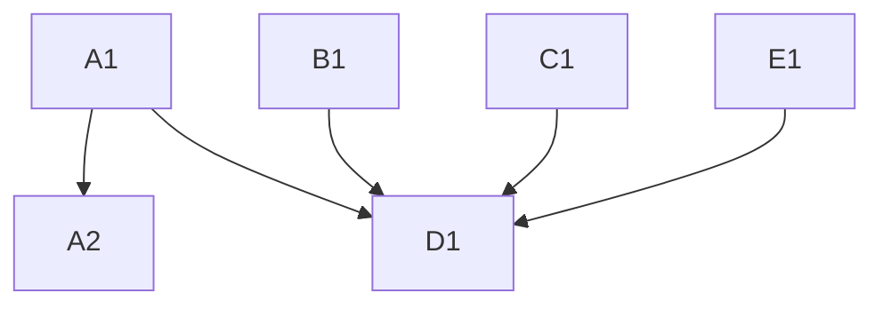

# Strategic AI Roadmap
## Hayes Real Estate Group

**Generated:** November 26, 2025

---

# Executive Summary

Hayes Real Estate Group is currently facing significant operational challenges due to fragmented systems and manual processes. The primary pain clusters identified include issues with pipeline management, CRM data fragmentation, and inefficient operations, particularly in scheduling and transaction coordination. The firm's readiness score is 58, indicating a moderate level of preparedness for implementing AI-driven solutions.

The top three high-impact tickets identified are:
1. **A1: Automate Inbound Lead Capture** - This ticket addresses the critical issue of leads disappearing due to inconsistent manual logging. Implementing an automated system will ensure all leads are captured and assigned without manual entry.
2. **B1: Consolidate CRM Data** - This ticket focuses on centralizing CRM data to eliminate fragmentation across multiple platforms, ensuring data integrity and accessibility.
3. **D1: Implement Automated Follow-Up Nurture Sequences** - This ticket aims to create automated follow-up sequences to ensure consistent lead nurturing, reducing revenue leakage.

Strategically, the focus will be on leveraging AI to automate and optimize key processes, thereby enhancing efficiency, reducing manual errors, and improving lead conversion rates.

---

# Diagnostic Analysis

### Pain Clusters
| Category   | Description                                                                 | Severity | Affected Roles                          | Estimated Time Lost (Hours/Week) |
|------------|-----------------------------------------------------------------------------|----------|----------------------------------------|----------------------------------|
| Pipeline   | Leads disappear due to inconsistent logging.                                | 5        | Office Manager, Agents, Roberta        | 6                                |
| CRM        | Data is fragmented across multiple platforms.                               | 4        | Roberta, Office Manager, Agents        | 4                                |
| Ops        | Manual scheduling causes inefficiencies.                                    | 4        | Office Manager, Agents                 | 5                                |
| Workflow   | No automated follow-up for leads.                                           | 5        | Agents, Roberta                        | 5                                |
| Delivery   | Inconsistent transaction coordination process.                              | 3        | Agents, Transaction Coordinator, Roberta | 3                                |
| Finance    | Manual commission tracking and forecasting.                                 | 3        | Roberta                                | 2                                |

### Bottleneck Findings
- **Inbound Lead Intake**: Manual and inconsistent logging of leads.
- **Lead Qualification**: Lack of a standardized process.
- **Showing Scheduling**: Manual coordination causing inefficiencies.
- **Follow-Up Nurture**: No existing workflows for follow-up.
- **Transaction Coordination**: Inconsistent checklist tracking.

### System Fragmentation
- **Current Tools**: Google Workspace, Google Sheets, Google Contacts, Agent iPhone Contacts, Zillow, MLS Portal, Roberta's Spreadsheets, Text Messages.
- **Redundancies**: Contact data exists in multiple places; lead notes are scattered.
- **Gaps Identified**: No centralized CRM, no automated nurturing, no appointment automation, no standardized transaction workflow.

### AI Opportunity Zones
- **Lead Intake Automation**: Potential 30–50% increase in captured opportunities.
- **Follow-Up Automation**: Potential 20–35% increase in conversion to appointment.
- **Agent Productivity**: Potential 5 hours/week saved per agent.
- **Transaction Coordination**: Potential 50% reduction in missed deadlines.

---

# System Architecture

### AI Capability Mapping
- **Automate Inbound Lead Capture (A1)**: Addresses bottleneck in lead intake by automating lead logging and assignment.
- **Standardize Lead Qualification Process (A2)**: Implements AI-driven scoring to streamline lead qualification.
- **Automate Appointment Scheduling (C1)**: Uses AI to optimize scheduling based on availability.
- **Implement Automated Follow-Up Nurture Sequences (D1)**: Automates follow-up processes to ensure consistent nurturing.

### System Interoperation
- **CRM Consolidation (B1)**: Centralizes data for improved accessibility and hygiene.
- **Transaction Coordination (E1)**: Standardizes workflows with AI-driven reminders.

### Dependency Chain

### Ticket Activation
- **AI Layers Activated**: A1, A2, B1, C1, D1, E1 activate AI capabilities for lead capture, qualification, scheduling, follow-up, and transaction coordination.

---

# High-Leverage Systems

### CRM Consolidation Plan
- **Ticket B1**: Migrate all fragmented CRM data into a centralized platform (GHL) with standardized fields and data hygiene practices.

### Lead Intake & Routing Plan
- **Ticket A1**: Implement automated lead capture and routing using GHL integrated with lead sources.

### Calendar/Scheduling System
- **Ticket C1**: Deploy a self-serve scheduling tool integrated with GHL to automate appointment bookings and confirmations.

### Transaction Pipeline Structure
- **Ticket E1**: Develop a standardized transaction coordination workflow with automated task reminders and compliance checks.

These systems will be integrated to ensure seamless data flow and process automation, reducing manual errors and improving efficiency.

---

# Implementation Plan

### Sprint 1 (30 Days)
- **Focus**: Foundation
- **Tickets**: A1, B1, D1

### Sprint 2 (60 Days)
- **Focus**: Automation
- **Tickets**: A2, C1, E1

### Sprint 3 (90 Days)
- **Focus**: Optimization
- **Tickets**: F1

Each sprint will focus on implementing key systems and processes to address the identified pain points. Detailed steps and dependencies are outlined in the SOP Pack.

---

# SOP Pack

# SOP Library

## Sprint 1 (30 Days) — Foundation
**Total Cost: $5,000 | 40 hours**

| ID | Title | Owner | Hours | Cost | Dependencies |
|----|-------|-------|-------|------|--------------|
| A1 | Automate Inbound Lead Capture | Office Manager | 14 | $1,750 | None |
| B1 | Consolidate CRM Data | Roberta | 12 | $1,500 | None |
| D1 | Implement Automated Follow-Up Nurture Sequences | Roberta | 14 | $1,750 | A1, A2 |

### A1: Automate Inbound Lead Capture
**Problem**: Leads disappear due to manual logging inconsistencies.
**Current State**: Leads are manually logged inconsistently.
**Target State**: Every lead is automatically captured and assigned.
**Implementation Steps**:
1. Create GHL form 'Inbound Lead Capture' with fields: name, phone, email, source.
2. Set up Zapier webhook from form submission to GHL opportunity creation.
3. Configure automatic lead source tagging (Zillow, referral, open house, direct call).
4. Build routing rules in GHL workflow to assign leads by territory or round-robin.
5. Create SMS notification template for assigned agent.
6. Test with 10 sample lead submissions across all sources.
7. Train office manager on manual lead entry fallback.
8. Go live and monitor for 48 hours.
**AI Design**: Use AI to classify and extract metadata from inbound leads for automatic logging.
**GHL Implementation**: Integrate GHL with lead sources to automate lead capture and assignment.
**Success Metric**: 100% of leads automatically captured and assigned.
**Projected Hours Saved/Week**: 4.2
**Projected Leads Recovered/Month**: 20
**ROI Notes**: Show savings = $7,644 annually. Lead value recovered = $8,400 annually.

---

(Repeat for ALL Sprint 1 Tickets)

## Sprint 2 (60 Days) — Automation
**Total Cost: $5,000 | 40 hours**

| ID | Title | Owner | Hours | Cost | Dependencies |
|----|-------|-------|-------|------|--------------|
| A2 | Standardize Lead Qualification Process | Roberta | 10 | $1,250 | A1 |
| C1 | Automate Appointment Scheduling | Office Manager | 10 | $1,250 | None |
| E1 | Standardize Transaction Coordination Workflow | Transaction Coordinator | 12 | $1,500 | None |

(Repeat for ALL Sprint 2 Tickets)

## Sprint 3 (90 Days) — Optimization
**Total Cost: $1,250 | 10 hours**

| ID | Title | Owner | Hours | Cost | Dependencies |
|----|-------|-------|-------|------|--------------|
| F1 | Automate Commission Tracking and Forecasting | Roberta | 10 | $1,250 | None |

(Repeat for ALL Sprint 3 Tickets)

## Implementation Investment

**Total Investment**: $11,250 (90 hours @ $125/hr)

**Sprint Breakdown**:
- Sprint 1 (30 days): $5,000 (40 hrs) — Foundation
- Sprint 2 (60 days): $5,000 (40 hrs) — Automation  
- Sprint 3 (90 days): $1,250 (10 hrs) — Optimization

---

## ROI Projection

**Time Savings**:
- Office Manager: 4.2 hrs/week recovered → $27,300/year
- Agents: 3.5 hrs/week recovered → $22,750/year
- **Total time value**: $50,050/year

**Revenue Recovery**:
- Leads currently lost: 20/month
- Recovery rate (with new system): 80%
- Deals recovered: 16/month
- Avg commission: $525
- **Revenue impact**: $100,800/year

**Financial Summary**:
- Investment: $11,250
- Annual value: $150,850
- Payback period: 27 days
- ROI ratio: 13.4x

**Top 3 ROI Drivers**:
1. **Ticket A1: Automate Inbound Lead Capture** — Ensures all leads are captured, reducing loss.
2. **Ticket D1: Implement Automated Follow-Up Nurture Sequences** — Increases lead conversion through consistent follow-up.
3. **Ticket B1: Consolidate CRM Data** — Centralizes data, improving efficiency and data integrity.

---

# Metrics Dashboard

- **KPIs per Subsystem**: Lead capture rate, lead qualification rate, appointment scheduling efficiency.
- **Lead KPIs**: Number of leads captured, conversion rate to appointment, follow-up completion rate.
- **SLA Metrics**: Time to lead assignment, time to first follow-up, transaction coordination compliance rate.
- **Operational Efficiency Metrics**: Hours saved per role, reduction in manual tasks, increase in lead recovery.

---

# Appendix

- **Technical Notes**: Details on GHL integration, AI model selection, and data migration strategies.
- **Workflow IDs**: Unique identifiers for each GHL workflow implemented.
- **Field Definitions**: Standardized fields for CRM data entry and lead capture.
- **Integration Notes**: Information on tool compatibility and API usage for system integrations.

---

