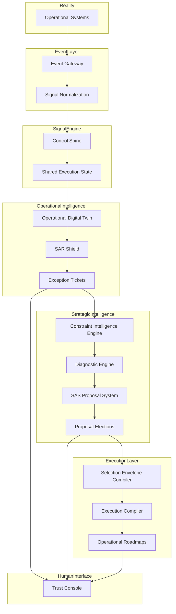


# StrategicAI Full System Topology

This document defines the complete system architecture of the StrategicAI platform.

StrategicAI is designed as a closed-loop operational intelligence system that
observes real-world operations, detects structural constraints, proposes
strategic interventions, and guides execution.

The platform operates through several coordinated subsystems.

---

# Core System Layers

The StrategicAI platform is composed of six major layers.

1. Operational Systems  
2. Event Layer  
3. Signal Intelligence Layer  
4. Operational Intelligence Layer  
5. Strategic Intelligence Layer  
6. Execution Layer  

Together these layers form a continuous operational intelligence loop.

---

# Layer 1 — Operational Systems

These are the real-world systems where work actually occurs.

Examples include:

ERP systems  
inventory management systems  
production scheduling systems  
supply chain systems  
CRM platforms  

Example systems observed in pilots:

NetSuite  
Excel schedules  
warehouse systems  
SharePoint task trackers  

These systems generate operational events.

---

# Layer 2 — Event Layer

The Event Layer collects operational signals from real-world systems.

Components:

Event Gateway  
Signal Ingestion Services  
Event Normalization  

Responsibilities:

capture operational events  
normalize events into a canonical schema  
forward signals into the Signal Engine  

Examples of captured events:

inventory updates  
production transfers  
schedule changes  
shipment confirmations  

---

# Layer 3 — Signal Intelligence Layer

The Signal Engine converts raw operational events into trusted signals.

Primary components:

Control Spine Service  
Shared Execution State  
Signal Normalization  

Responsibilities:

verify operational signals  
resolve conflicts between systems  
produce authoritative operational state  

The Control Spine acts as the arbitration layer between multiple operational inputs.

---

# Layer 4 — Operational Intelligence Layer

This layer maintains a real-time representation of the organization’s operations.

Primary components:

Operational Digital Twin  
SAR Shield Intelligence Engine  
Exception Ticket System  

Responsibilities:

maintain the authoritative operational model  
detect divergences between expected and observed state  
generate exception signals when drift occurs  

This layer enables real-time operational awareness.

---

# Layer 5 — Strategic Intelligence Layer

The StrategicAI reasoning engine operates here.

Primary components:

Constraint Intelligence Engine  
Diagnostic Engine  
Assisted Synthesis System (SAS)  
Proposal Election System  

Responsibilities:

detect structural constraints within operations  
generate strategic proposals  
coordinate human review and proposal selection  

This layer transforms operational signals into strategic improvements.

---

# Layer 6 — Execution Layer

The execution layer converts strategy into operational change.

Primary components:

Selection Envelope Compiler  
Execution Compiler  
Operational Roadmap Generator  

Responsibilities:

compile approved proposals  
generate deterministic execution plans  
create operational tasks and automation workflows  

Execution artifacts may include:

SOP tickets  
automation tasks  
strategic roadmaps  

---

# Human Interface Layer

Human operators interact with the system through the Trust Console.

Components include:

Executive Dashboard  
Operational Exception Board  
Strategic Proposal Interface  

The Trust Console provides visibility into both operational signals and
strategic interventions.

---

# Closed Intelligence Loop

The StrategicAI platform operates as a continuous intelligence loop.

Operational systems generate events.

Events are captured by the Event Layer.

Signals are validated by the Control Spine.

Operational state is modeled by the Digital Twin.

SAR Shield detects operational divergence.

The Constraint Intelligence Engine diagnoses structural issues.

Strategic proposals are generated and evaluated.

Execution plans implement improvements.

Operational systems update as changes are applied.

The cycle then repeats.

---

# System Topology Diagram

---

# StrategicAI Intelligence Model

StrategicAI differs from traditional analytics systems.

Traditional analytics answers:

What happened?

StrategicAI answers:

Why did it happen?  
What constraint caused it?  
What structural change will resolve it?

This allows StrategicAI to function as a continuous strategic guidance system
for organizations.

---

# StrategicAI System Summary

StrategicAI connects real-world operations to strategic decision systems
through a layered intelligence architecture.

Operational systems produce signals.

Signals become operational intelligence.

Operational intelligence becomes strategic insight.

Strategic insight drives execution.

Execution changes operational reality.

This closed-loop system enables organizations to continuously improve their
operational structure and strategic performance.