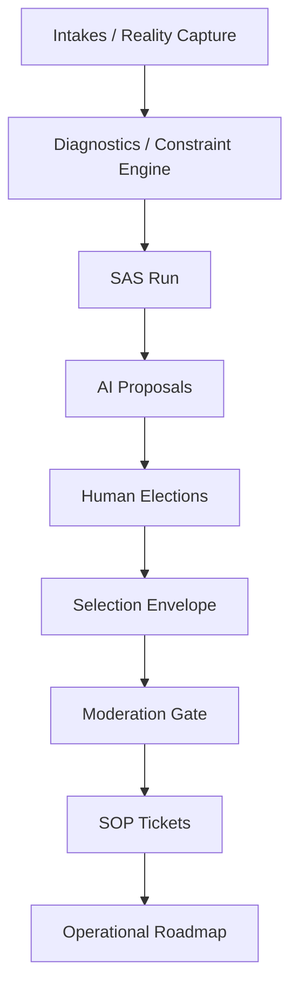
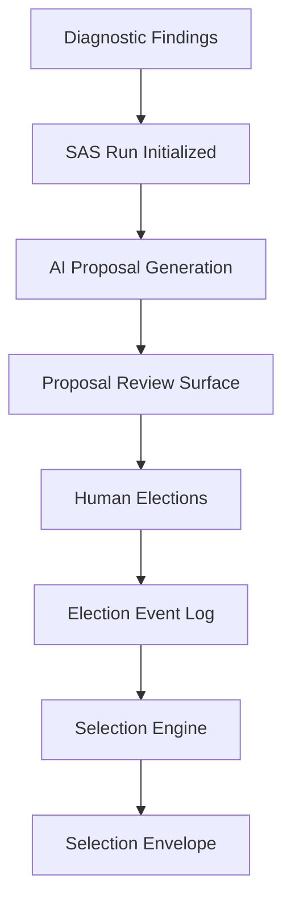
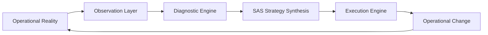
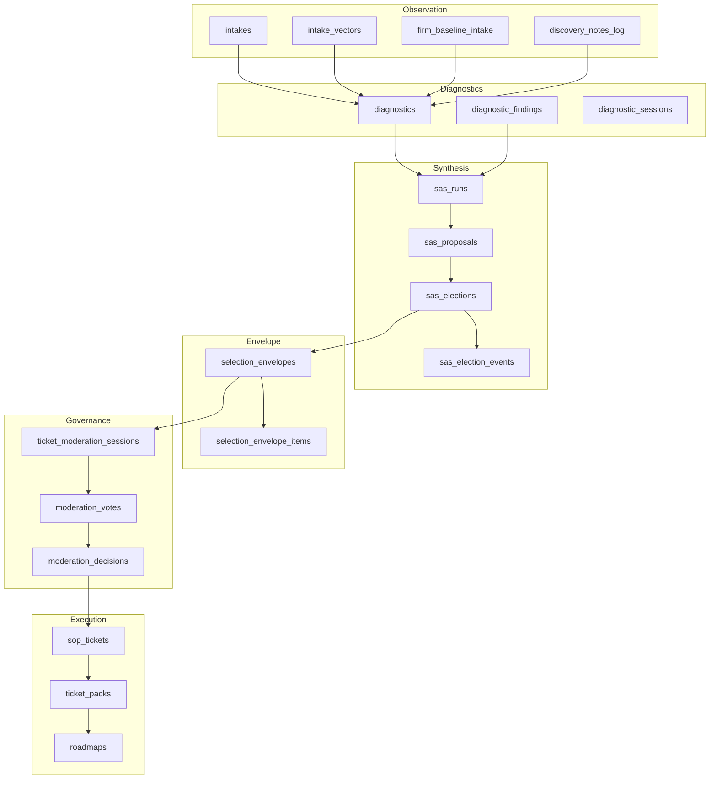
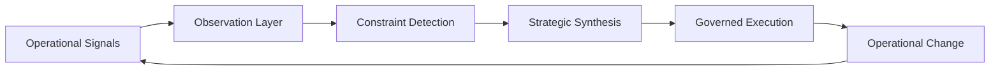
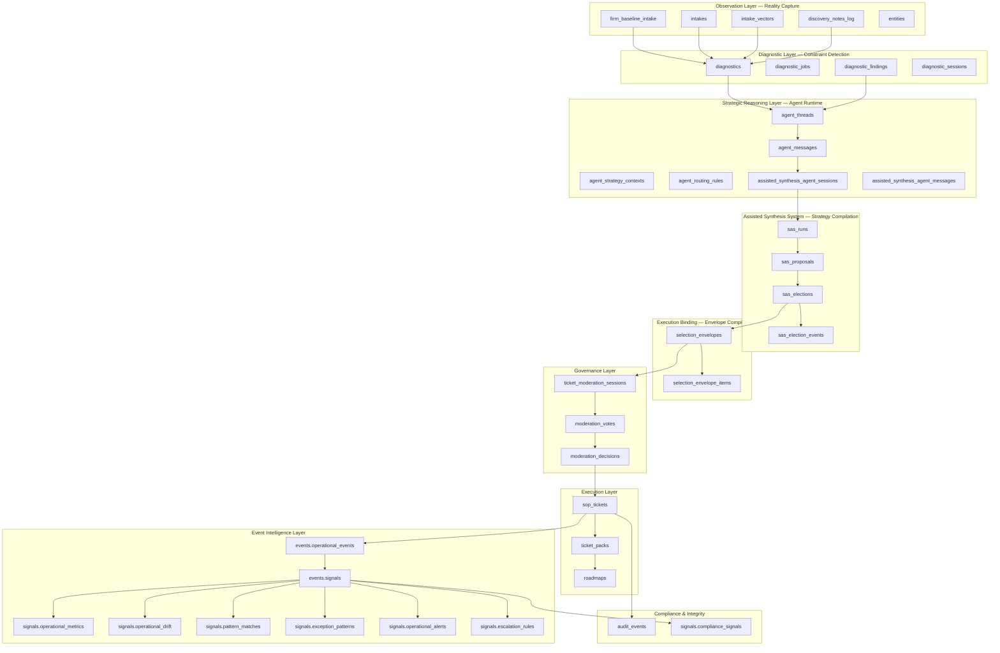
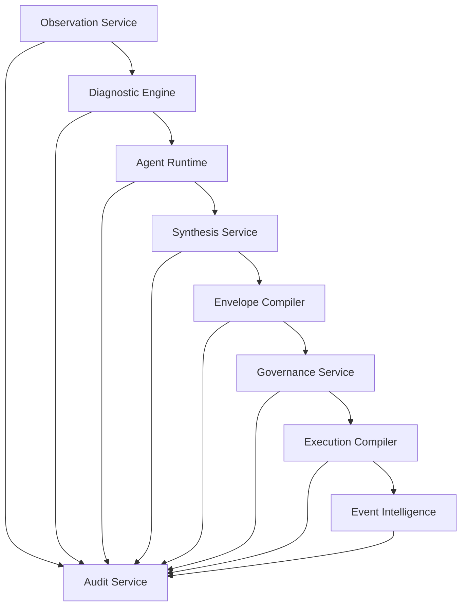

# StrategicAI System Architecture Map

## Layer 0 — Identity + Tenancy Boundary

Tables

- tenants
- users
- tenant\_stage6\_config

Purpose

- Multi-tenant isolation
- Capability policy enforcement
- Stage‑6 activation rules

This layer determines:

- what a tenant is allowed to synthesize
- what adapters can be activated
- what complexity tier is allowed

---

## Layer 1 — Reality Capture (Observation Layer)

Tables

- firm\_baseline\_intake
- intakes
- intake\_vectors
- discovery\_call\_notes
- discovery\_notes\_log

Purpose

- Capture organizational reality
- Capture behavioral signals
- Capture exception events

Concept Organizational telemetry ingestion.

---

## Layer 2 — Diagnostic Intelligence

Tables

- diagnostics
- diagnostic\_jobs
- diagnostic\_findings
- diagnostic\_sessions

Output

- canonicalFindings

Purpose

- identify constraints
- detect bottlenecks
- surface risk
- reveal automation opportunities

Concept Structural X‑Ray of the organization.

---

## Layer 3 — Assisted Synthesis System (SAS)

Tables

- sas\_runs
- sas\_proposals
- sas\_elections
- sas\_election\_events

Lifecycle

sas\_run → AI generates proposals → humans elect proposals → elected proposals feed execution compiler

Concept Human‑governed AI synthesis.

---

## Layer 4 — Selection Envelope Compiler

Tables

- selection\_envelopes
- selection\_envelope\_items
- legacy\_selection\_envelopes

Purpose Compile deterministic execution plan.

Envelope Contains

- selected proposals
- required adapters
- inventory dependencies
- execution hash

Concept Immutable execution binding.

Execution must match envelope hash.

---

## Layer 5 — Governance & Moderation

Tables

- ticket\_moderation\_sessions
- moderation\_votes
- moderation\_decisions

Flow

selection\_envelope → ticket draft → moderation → execution approval

Purpose Human governance before operational execution.

---

## Layer 6 — Execution Compiler

Execution compilation is defined in:

- stage6_execution_compiler.md
- stage7_graph_compiler.md

Tables

- tickets\_draft
- sop\_tickets
- ticket\_packs
- roadmaps

Purpose Convert strategic synthesis into operational tasks.

Examples

- automation tickets
- process redesign
- ERP integrations
- inventory control
- exception monitoring

---

## Layer 7 — Adapter & Integration Layer

Adapters

- NetSuite
- SharePoint
- GHL
- Slack
- ERP systems
- POS systems
- Inventory systems
- Telemetry pipelines

Adapters referenced in selection\_envelope\_items.adapter\_ids

Purpose Bridge roadmap execution to real-world systems.

---

## Layer 8 — Event Store (Signal Integrity)

Tables

- discovery\_notes\_log
- sas\_election\_events
- audit logs
- diagnostic jobs

Purpose Organizational memory.

System can reconstruct full reasoning chain.

---

# StrategicAI Authority Spine

Artifact lineage

intakes → diagnostics → sas\_runs → sas\_proposals → sas\_elections → selection\_envelopes → ticket\_moderation\_sessions → sop\_tickets → roadmaps

Purpose Structural traceability across the entire system.

---

# StrategicAI Core System Model

The platform is composed of three cooperating systems.

## System 1 — Organizational MRI

Tables

- intakes
- diagnostics
- discovery\_notes

Purpose Reveal structural truth of the organization.

## System 2 — Strategic Synthesis Engine

Tables

- sas\_runs
- sas\_proposals
- sas\_elections
- selection\_envelopes

Purpose Compile AI‑assisted strategic plans with human governance.

## System 3 — Execution Engine

Tables

- tickets
- roadmaps
- adapters

Purpose Transform strategy into operational execution.

---

# StrategicAI System Function

The system performs the following transformation:

organizational observation → constraint diagnosis → AI synthesis → human governance → deterministic execution

This forms a governed intelligence operating system for organizations.

---

# Authority Spine — Visual Diagram



This diagram represents the **canonical artifact lineage** that defines how organizational signals become executable operations.

---

# Stage‑6 Activation Gate

Stage‑6 is where synthesis becomes executable infrastructure.

Key Binding Objects

- `selection_envelopes`
- `selection_envelope_items`
- `sop_tickets.selection_envelope_id`

Execution Rule

```
Execution is only allowed if:

selection_envelope exists
AND envelope_hash matches
AND moderation approval exists
```

This prevents:

- recomputation drift
- unauthorized automation
- strategy tampering

The envelope therefore acts as a **deterministic execution contract**.

---

# Agent Governance Surfaces

StrategicAI contains several implicit governance agents.

Projection Authority

Responsible for emitting **canonical findings** from diagnostic analysis.

Selection Engine

Responsible for compiling elected proposals into the deterministic execution envelope.

Moderation Gate

Responsible for human governance approval before execution artifacts are created.

These surfaces create a **fail‑closed governance loop**.

---

# Integration Surfaces (Pilot Systems)

StrategicAI integrates with real operational systems via adapters.

Primary pilot integrations:

- NetSuite (financial + ERP telemetry)
- SharePoint / Excel (operational spreadsheets)
- GHL (alerts, tasks, escalation messaging)

Future integrations:

- Slack
- POS systems
- inventory telemetry
- production scheduling

Adapter activation is controlled through:

```
tenant_stage6_config
selection_envelope_items.adapter_ids
```

This ensures that only **approved integrations** are allowed to activate during roadmap execution.

---

# Execution Traceability

StrategicAI maintains full artifact lineage.

Operational roadmap items can be traced back through:

```
roadmap item
→ SOP ticket
→ moderation session
→ selection envelope
→ elected proposal
→ SAS run
→ diagnostic finding
→ intake
```

This creates **organizational truth lineage**, allowing every operational change to be traced back to its originating signal.

---

# Architectural Summary

StrategicAI functions as a governed intelligence compiler.

It converts:

organizational signals → diagnostic intelligence → AI synthesis → human governance → deterministic operational execution

This architecture enables organizations to move from observation to execution without losing traceability, governance, or structural integrity.

---

# SAS Internal Lifecycle



Purpose

This lifecycle describes how **diagnostic intelligence becomes actionable strategy**.

Key Properties

- AI proposes interventions
- Humans elect valid proposals
- Election history is permanently logged
- Selection engine compiles deterministic envelope

This prevents uncontrolled AI automation while preserving **human strategic authority**.

---

# Constraint Intelligence Loop

StrategicAI operates as a continuous feedback loop rather than a one‑time analysis engine.



Loop Meaning

1. Observe real organizational signals
2. Diagnose structural constraints
3. Synthesize strategic interventions
4. Execute operational changes
5. Measure new operational reality

The system therefore functions as a **Constraint Intelligence Engine** for organizations.

---

# System Boundaries

StrategicAI is intentionally designed with strict system boundaries.

## StrategicAI Core Responsibilities

Owned by the platform:

- organizational signal ingestion
- diagnostic intelligence
- AI strategy synthesis
- governance and moderation
- deterministic execution compilation
- roadmap generation

## Adapter Responsibilities

Owned by external systems:

- ERP data storage (NetSuite)
- operational spreadsheets (SharePoint / Excel)
- communication systems (Slack / GHL)
- production telemetry
- POS / inventory systems

StrategicAI does **not replace operational systems**.

Instead it functions as the **coordination intelligence layer** above them.

---

# StrategicAI Operating Model

The platform can be understood as a four‑stage operational stack:

1. Observation

Capture real organizational signals.

2. Intelligence

Diagnose structural constraints using analytical models.

3. Governance

AI proposes interventions, humans elect valid strategies.

4. Execution

Compile deterministic operational roadmaps and deploy through adapters.

This model allows StrategicAI to operate as an **organizational operating system rather than a traditional analytics platform**.

---

# Full StrategicAI Data Architecture



Purpose

This diagram shows the **true artifact flow through the StrategicAI database**. Each layer produces the inputs required by the next layer, forming a deterministic transformation pipeline from organizational signals to operational execution.

---

# Agent Execution Topology

```mermaid
flowchart LR

subgraph Signal Processing
A[Observation Ingestion]
B[Diagnostic Engine]
end

subgraph Strategy Formation
C[Projection Authority]
D[SAS Generator]
E[Human Election Layer]
end

subgraph Execution Compilation
F[Selection Engine]
G[Envelope Compiler]
end

subgraph Governance
H[Moderation Gate]
end

subgraph Operations
I[Execution Compiler]
J[Adapter Router]
K[External Systems]
end

A --> B
B --> C
C --> D
D --> E
E --> F
F --> G
G --> H
H --> I
I --> J
J --> K
```



Agent Roles

Projection Authority

Transforms diagnostic intelligence into canonical strategic findings.

SAS Generator

Generates AI-assisted proposals for operational intervention.

Selection Engine

Compiles elected proposals into deterministic envelopes.

Moderation Gate

Applies human governance before operational activation.

Execution Compiler

Transforms envelopes into executable SOP tickets and roadmap artifacts.

Adapter Router

Routes execution tasks to external operational systems such as ERP, messaging, or telemetry infrastructure.

Together these components form the **StrategicAI execution pipeline**, allowing governed AI strategy to become real operational change.

---

# StrategicAI Constraint Intelligence Engine

StrategicAI is fundamentally designed as a **constraint intelligence system**. Instead of merely analyzing data, it continuously identifies structural bottlenecks inside organizations and compiles governed interventions to resolve them.



Engine Meaning

1. **Operational Signals** — Real-world events, telemetry, and human observations enter the system.
2. **Observation Layer** — Intakes, discovery notes, and telemetry capture organizational reality.
3. **Constraint Detection** — Diagnostic models identify structural bottlenecks, risks, and inefficiencies.
4. **Strategic Synthesis** — The SAS system proposes strategic interventions governed by human elections.
5. **Governed Execution** — The envelope compiler and moderation system convert strategy into executable artifacts.
6. **Operational Change** — Execution alters the organization, generating new signals that feed the next cycle.

This loop transforms StrategicAI from a static analysis tool into a **living organizational intelligence engine** capable of continuously diagnosing and resolving structural constraints.


---

# Canonical StrategicAI System Topology



## Topology Meaning

The StrategicAI platform operates as a layered intelligence system where each stage transforms organizational signals into progressively more structured artifacts.

1. Observation captures raw organizational reality.
2. Diagnostics transform observations into structural constraints.
3. Agent Runtime performs contextual reasoning over those constraints.
4. Assisted Synthesis generates candidate strategic interventions.
5. Envelope Compilation binds elected proposals into deterministic execution plans.
6. Governance applies human authorization.
7. Execution converts strategy into operational change.
8. Event Intelligence monitors real-world telemetry and detects patterns.
9. Compliance & Integrity records verifiable operational history.

This topology represents the **canonical architecture spine** of StrategicAI and should serve as the authoritative reference for aligning database schema, services, and frontend interfaces.


---

# StrategicAI Kernel — Minimal Service Architecture

The StrategicAI kernel is composed of a small set of logical services that align directly with the system topology layers. These are **not microservices**; they are modular service domains within the backend that each own a specific slice of the architecture.

## Service 1 — Observation Service

Owns tables

- firm_baseline_intake
- intakes
- intake_vectors
- discovery_notes_log
- entities

Responsibilities

- createIntake()
- appendDiscoveryNote()
- registerEntity()
- resolveEntity()

Artifact Produced

ObservationRecord

Directory

backend/services/observation/

---

## Service 2 — Diagnostic Engine

Owns tables

- diagnostics
- diagnostic_jobs
- diagnostic_findings
- diagnostic_sessions

Responsibilities

- runDiagnostic()
- computeConstraintMap()
- persistFindings()
- loadFindings()

Artifact Produced

canonical_findings

Directory

backend/services/diagnostics/

---

## Service 3 — Agent Runtime

Owns tables

- agent_threads
- agent_messages
- agent_strategy_contexts
- agent_routing_rules

Responsibilities

- createThread()
- appendMessage()
- resolveRouting()
- loadContext()

Artifact Produced

reasoning_trace

Directory

backend/services/agentRuntime/

---

## Service 4 — Assisted Synthesis (SAS)

Owns tables

- assisted_synthesis_agent_sessions
- assisted_synthesis_agent_messages
- sas_runs
- sas_proposals
- sas_elections
- sas_election_events

Responsibilities

- startSynthesisSession()
- generateProposals()
- recordElection()
- computeProposalStats()

Artifact Produced

proposal_set

Directory

backend/services/synthesis/

---

## Service 5 — Envelope Compiler

Owns tables

- selection_envelopes
- selection_envelope_items

Responsibilities

- compileEnvelope()
- validateEnvelope()
- freezeEnvelope()

Artifact Produced

ExecutionEnvelope

Directory

backend/services/envelopeCompiler/

---

## Service 6 — Governance Service

Owns tables

- ticket_moderation_sessions
- moderation_votes
- moderation_decisions

Responsibilities

- openModerationSession()
- recordVote()
- finalizeModeration()

Artifact Produced

ModerationDecision

Directory

backend/services/governance/

---

## Service 7 — Execution Compiler

Owns tables

- sop_tickets
- ticket_packs
- roadmaps

Responsibilities

- generateTickets()
- buildRoadmap()
- publishExecutionPlan()

Artifact Produced

OperationalExecutionPlan

Directory

backend/services/execution/

---

## Service 8 — Event Intelligence Engine

Owns tables

- events.operational_events
- events.signals
- signals.operational_metrics
- signals.operational_drift
- signals.pattern_matches
- signals.exception_patterns
- signals.operational_alerts
- signals.escalation_rules
- signals.compliance_signals

Responsibilities

- ingestEvent()
- detectDrift()
- matchPatterns()
- triggerEscalation()

Artifact Produced

OperationalSignal

Directory

backend/services/eventIntelligence/

---

## Service 9 — System Integrity (Audit)

Shared table

- audit_events

Responsibilities

- auditEvent()

Example audit events

- proposal_created
- envelope_compiled
- moderation_completed
- ticket_generated
- signal_detected

Directory

backend/services/audit/

---

# StrategicAI Kernel Service Flow



Purpose

This service topology forms the **StrategicAI Kernel**. Each service owns a specific architectural layer and produces deterministic artifacts that feed the next stage of the system.

This model ensures:

- clear ownership of database tables
- deterministic artifact lineage
- modular backend architecture
- safe evolution of the StrategicAI platform

